Apache utilizará el puerto 81 además del 80
Para esta actividad usaremos el comando: 
sudo nano /etc/apache2/ports.conf
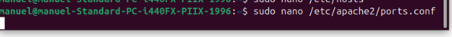

y cambiaremos la línea:
Listen 80
a
Listen 80
Listen 81
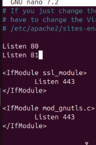

Añadir el dominio “marisma.intranet” en el fichero “hosts”

Para ello, editamos el fichero “hosts” con:
sudo nano /etc/hosts

Añadimos la siguiente línea:
127.0.0.1	marisma.intranet
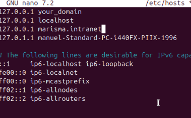

Cambia la directiva “ServerTokens” para mostrar el nombre del producto.
Para ello usarmos: 
sudo nano /etc/apache2/conf-available/security.conf
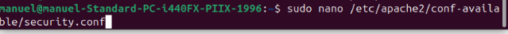

Cambiamos la línea:
ServerTokens OS
a
ServerTokens Full
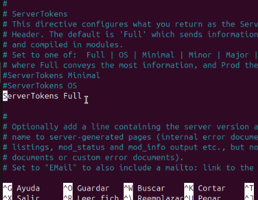

Crea un directorio “prueba” y otro directorio “prueba2”. Incluye un par de páginas en cada una de ellas.

Para crear los directorios usamos:
sudo mkdir /var/www/html/prueba
sudo mkdir /var/www/html/prueba2
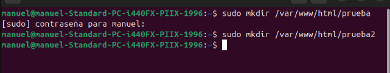

Para crear las páginas usamos:
sudo nano /var/www/html/prueba/index.html
sudo nano /var/www/html/prueba2/index.html
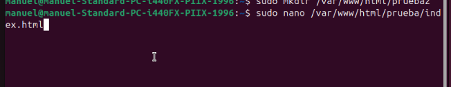
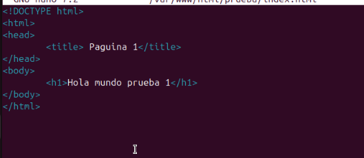
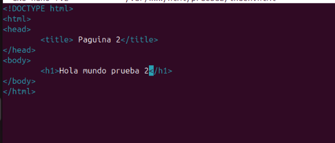

Redirecciona el contenido de la carpeta “prueba” hacia “prueba2”

Para ello, editamos el fichero “000-default.conf” con:
sudo nano /etc/apache2/sites-available/000-default.conf
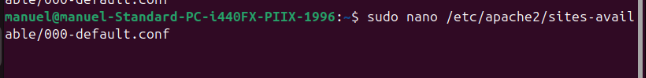

Añadimos la siguiente línea:
Redirect /prueba /prueba2
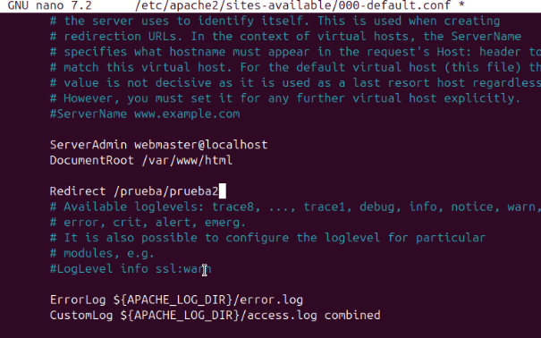

Es posible redireccionar tan solo una página en lugar de toda la carpeta. Pruébalo.
Para ello, editamos el fichero “000-default.conf” con:
sudo nano /etc/apache2/sites-available/000-default.conf

Añadimos la siguiente línea:
Redirect /prueba/index.html /prueba2/index.html
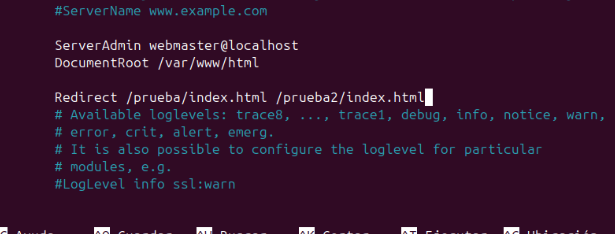

Usa la directiva userdir para acceder a la carpeta “prueba” desde el navegador.
Para ello, editamos el fichero “000-default.conf” con:
sudo nano /etc/apache2/sites-available/000-default.conf

Añadimos la siguiente línea:
UserDir /var/www/html
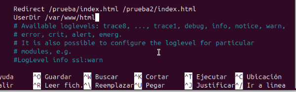

Usa la directiva alias para redireccionar a una carpeta dentro del directorio de usuario.
Para ello, editamos el fichero “000-default.conf” con:
sudo nano /etc/apache2/sites-available/000-default.conf

Añadimos la siguiente línea:
Alias /prueba /var/www/html/prueba
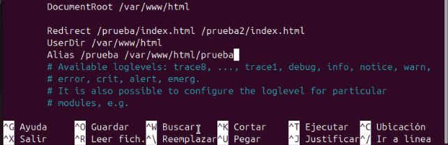

¿Para qué sirve la directiva Options y dónde aparece. Comprueba si apache indexa los directorios. Si es así, ¿cómo lo desactivamos?

