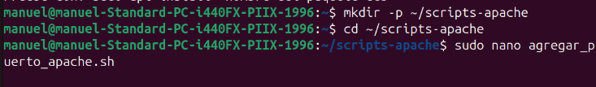
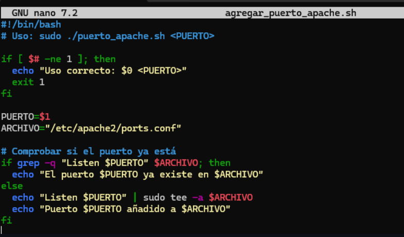
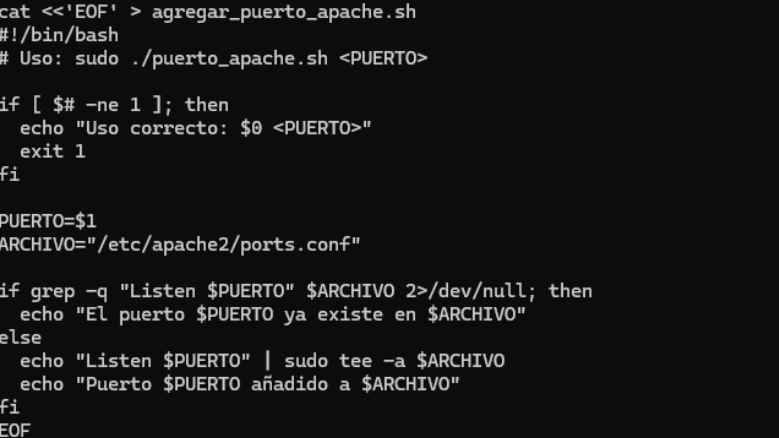
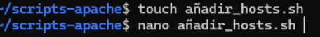
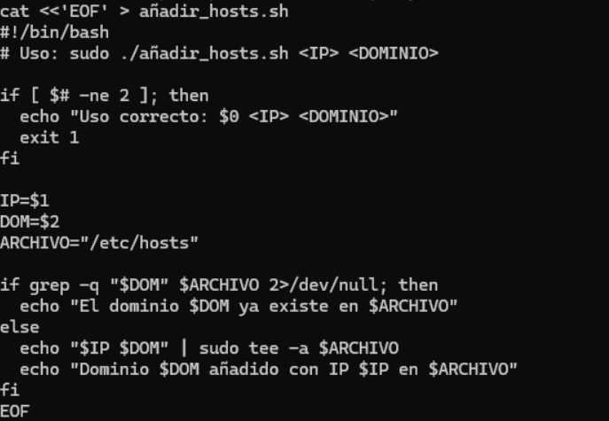
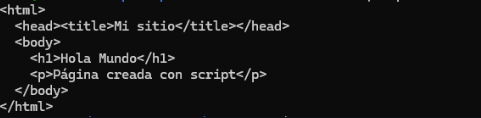
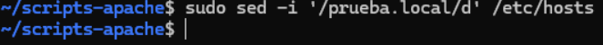
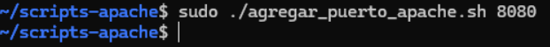

Apache utilizará el puerto 81 además del 80
Para esta actividad usaremos el comando: 

    sudo nano /etc/apache2/ports.conf

y cambiaremos la línea:

    Listen 80
    a
    Listen 80
    Listen 81

Añadir el dominio “marisma.intranet” en el fichero “hosts”

Para ello, editamos el fichero “hosts” con:

    sudo nano /etc/hosts

Añadimos la siguiente línea:

    127.0.0.1	marisma.intranet

Cambia la directiva “ServerTokens” para mostrar el nombre del producto.
Para ello usarmos: 

    sudo nano /etc/apache2/conf-available/security.conf

Cambiamos la línea:

    ServerTokens OS
    a
    ServerTokens Full

Crea un directorio “prueba” y otro directorio “prueba2”. Incluye un par de páginas en cada una de ellas.

Para crear los directorios usamos:

    sudo mkdir /var/www/html/prueba
    sudo mkdir /var/www/html/prueba2

Para crear las páginas usamos:
    sudo nano /var/www/html/prueba/index.html
    sudo nano /var/www/html/prueba2/index.html

Redirecciona el contenido de la carpeta “prueba” hacia “prueba2”

Para ello, editamos el fichero “000-default.conf” con:

    sudo nano /etc/apache2/sites-available/000-default.conf

Añadimos la siguiente línea:

    Redirect /prueba /prueba2

Es posible redireccionar tan solo una página en lugar de toda la carpeta. Pruébalo.
Para ello, editamos el fichero “000-default.conf” con:

    sudo nano /etc/apache2/sites-available/000-default.conf

Añadimos la siguiente línea:

    Redirect /prueba/index.html /prueba2/index.html

Usa la directiva userdir para acceder a la carpeta “prueba” desde el navegador.
Para ello, editamos el fichero “000-default.conf” con:

    sudo nano /etc/apache2/sites-available/000-default.conf

Añadimos la siguiente línea:

    UserDir /var/www/html

Usa la directiva alias para redireccionar a una carpeta dentro del directorio de usuario.
Para ello, editamos el fichero “000-default.conf” con:

    sudo nano /etc/apache2/sites-available/000-default.conf

Añadimos la siguiente línea:

    Alias /prueba /var/www/html/prueba

¿Para qué sirve la directiva Options y dónde aparece. Comprueba si apache indexa los directorios. Si es así, ¿cómo lo desactivamos?

*Directiva Options en Apache*

    La directiva Options define qué características están permitidas en un directorio del servidor Apache (por ejemplo, mostrar listados, seguir enlaces simbólicos o ejecutar scripts).
Se encuentra en archivos como:

    /etc/apache2/apache2.conf
    /etc/apache2/sites-available/000-default.conf
    .htaccess

*Comprobar si Apache indexa directorios*

Si al acceder a una carpeta desde el navegador (por ejemplo, http://localhost/test/) ves una lista de archivos, Apache está indexando el directorio.

También puedes verlo en la configuración si aparece la línea:

    Options Indexes

*Desactivar la indexación de directorios*

Edita el bloque del directorio y elimina Indexes o usa -Indexes, por ejemplo:

    <Directory /var/www/html>
        Options -Indexes +FollowSymLinks
    </Directory>

Reinicia Apache para aplicar los cambios:

    sudo systemctl restart apache2

De esta forma, se evitará que se muestre el listado de archivos en el navegador.

-----------------------------------------------------------------------------------

Trabajando con scripts  (Debes publicarlos en Github)
Crea un script para cada uno de los siguientes problemas:

1-Crea un script que añada un puerto de escucha en el fichero de configuración de Apache. El puerto se recibirá como parámetro en la llamada y se comprobará que no esté ya presente en el fichero de configuración.

Primero creamos el repositorio en la ruta de scripts apache, entramos y vamos a editar el fichero ports.conf

    mkdir -p ~/scripts-apache
    cd ~/scripts-apache
    sudo nano agregar_puerto_apache.sh

Agregamos el codigo para que podamos agregar el puerto al fichero de configuracion de apache, salimos y guardamos con control + o y control + x

Ahora probamos el script con ./agregar_puerto_apache.sh 81 y comprobamos que se ha agregado el puerto 81 al fichero de configuracion de apache

Ahora creamos el fichero añadir_hosts.sh y agregamos el codigo para que podamos agregar el dominio y la ip al fichero hosts

guardamos salimos mostramos de que el fichero se crio y probamos con ./añadir_hosts.sh marisma.intranet 127.0.0.1
   

2-Crea un script que añada un nombre de dominio y una ip al fichero hosts. Debemos comprobar que no existe dicho dominio en el fichero hosts

Ahora creamos el fichero de crear_web.sh y agregamos el codigo para que podamos crear una pagina web con un titulo, una cabecera y un mensaje

Ahora vamos a probar a crear la web solamentee con el script para eso usamos ./crear_web.sh marisma.intranet "Hola mundo" "Pagina creada con script" , y mostramos l contnido

3-Crea un script que nos permita crear una página web con un título, una cabecera y un mensaje

Usamos sed para agregar la ip y el dominio prueba.local al fichero hosts

Ahora hacemos un sudo ./agregar_puerto_apache.sh 8080 para agregar el puerto 8080 al fichero de configuracion de apache

Y por ultimo reiniciamos apache con sudo systemctl restart apache2
