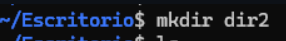
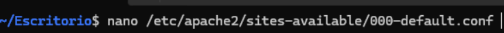
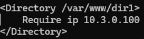
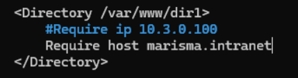
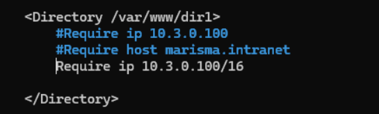
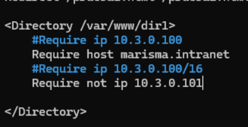

1.Crea un directorio llamado "dir1" y otro llamado "dir2"

2.Explica qué diferencia existe entre ambos y muestra su equivalencia con la directiva Require:

    <Directory /var/www/example1>
    Order Deny,Allow
    Deny from All
    Allow from 192.168.1.100
    </Directory>

    <Directory /var/www/example1>
    Order Allow,Deny
    Deny from All
    Allow from 192.168.1.100
    </Directory>

| Configuración antigua                                                     | Resultado                      | Nueva sintaxis (Require)          |
|---------------------------------------------------------------------------|--------------------------------|-----------------------------------|
| `Order Deny,Allow` + `Deny from all` + `Allow from 192.168.1.100`        | Solo permite a `192.168.1.100` | `Require ip 192.168.1.100`        |
| `Order Allow,Deny` + `Deny from all` + `Allow from 192.168.1.100`        | Niega a todos                  | `Require all denied`              |

3.Para dir1 
a. Permite el acceso de las peticiones provenientes de 10.3.0.100

Y ahora agregamos la siguientes lineas

b. Permite el acceso desde "marisma.intranet"
Para esto entramos a la ruta donde antes y agregamos el 'require host marisma.intranet'

Y agregamos el require del marisma.intranet

c. Permite el acceso desde cualquier subdominio de "marisma.intranet"

Este antiguamente si teniamos que hacer lo del

    Order Deny,Allow
    Deny from all
    Allow from .marisma.intranet

Pero a día de hoy con lo que pusimos anteriormente ya funciona en cualquier subdominio

d. Permite el acceso de las peticiones provenientes de "10.3.0.100" con máscara "255.255.0.0"

4.Modifica la configuración de forma que el acceso a dir1: 
a. Se permita a "marisma.intranet" y no se permita desde 10.3.0.101" lo mismo y para que no pueda ponemos el require not ip y la ip

5.Modifica la configuración de forma que el acceso a dir2: 
a. Se permita a "10.3.0.100/8" y no a "marisma.intranet Permite cualquier IP del rango 10.x.x.x.
Bloquea específicamente cualquier cliente cuyo nombre de host coincida con marisma.intranet.

