# Instalación de Docker en Ubuntu

## Índice
1. [Requisitos previos](#requisitos-previos)
2. [Desinstalar versiones antiguas](#desinstalar-versiones-antiguas)
3. [Instalar Docker Engine](#instalar-docker-engine)
4. [Verificar la instalación](#verificar-la-instalación)
5. [Usar Docker sin sudo](#usar-docker-sin-sudo)
6. [Comandos básicos](#comandos-básicos)
7. [Ejecutar el primer contenedor](#ejecutar-el-primer-contenedor)

---

## Requisitos previos

- Ubuntu 20.04 / 22.04 / 24.04 (64 bits)
- Acceso a terminal con privilegios `sudo`
- Conexión a internet

---

## Desinstalar versiones antiguas

Antes de instalar, elimina cualquier versión antigua de Docker que pueda estar instalada:

```bash
sudo apt remove docker docker-engine docker.io containerd runc
```

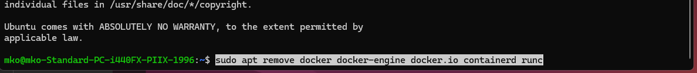

---

## Instalar Docker Engine

### 1. Actualizar el índice de paquetes e instalar dependencias

```bash
sudo apt update
sudo apt install -y \
    ca-certificates \
    curl \
    gnupg \
    lsb-release
```

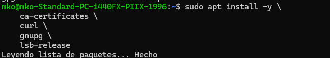

### 2. Añadir la clave GPG oficial de Docker

```bash
sudo install -m 0755 -d /etc/apt/keyrings

curl -fsSL https://download.docker.com/linux/ubuntu/gpg | \
    sudo gpg --dearmor -o /etc/apt/keyrings/docker.gpg

sudo chmod a+r /etc/apt/keyrings/docker.gpg
```

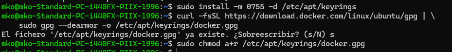

### 3. Añadir el repositorio oficial de Docker

```bash
echo \
  "deb [arch=$(dpkg --print-architecture) signed-by=/etc/apt/keyrings/docker.gpg] \
  https://download.docker.com/linux/ubuntu \
  $(. /etc/os-release && echo "$VERSION_CODENAME") stable" | \
  sudo tee /etc/apt/sources.list.d/docker.list > /dev/null
```

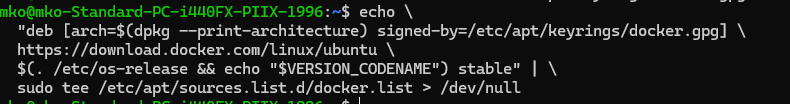

### 4. Instalar Docker Engine

```bash
sudo apt update
sudo apt install -y docker-ce docker-ce-cli containerd.io docker-buildx-plugin docker-compose-plugin
```

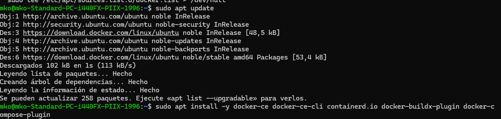

### 5. Iniciar y habilitar el servicio

```bash
sudo systemctl start docker
sudo systemctl enable docker
```

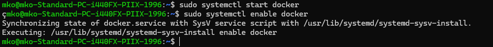

---

## Verificar la instalación

Comprueba que Docker está activo:

```bash
sudo systemctl status docker
```

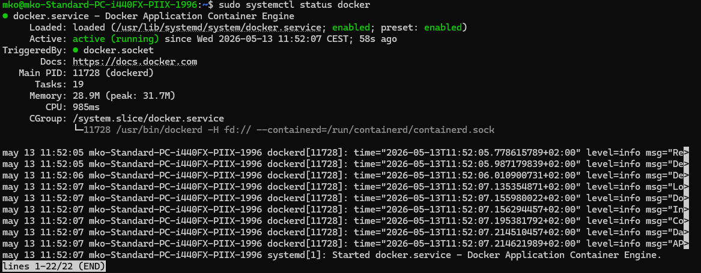

Prueba la imagen `hello-world`:

```bash
sudo docker run hello-world
```

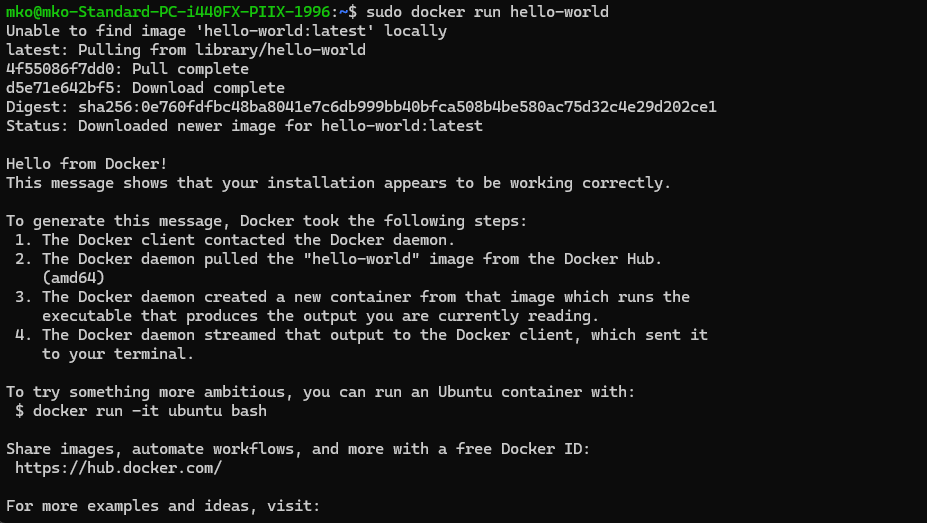

Comprueba la versión instalada:

```bash
docker --version
```

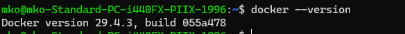

---

## Usar Docker sin sudo

Por defecto, Docker requiere `sudo`. Para ejecutarlo como usuario normal, añade tu usuario al grupo `docker`:

```bash
sudo usermod -aG docker $USER
```


Cierra la sesión y vuelve a iniciarla (o ejecuta `newgrp docker`) para que los cambios tengan efecto. Verifica que funciona sin `sudo`:

```bash
docker run hello-world
```

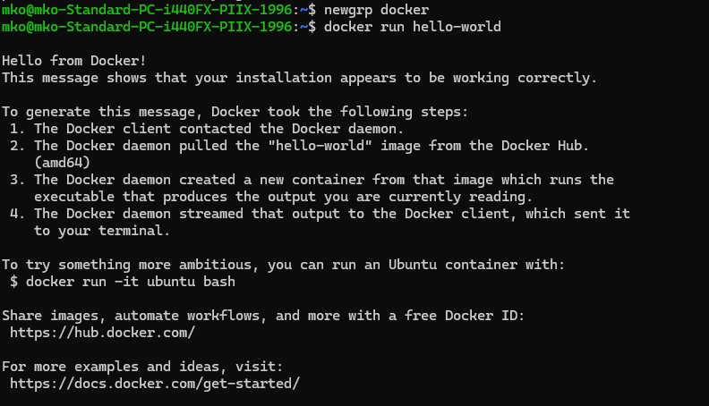

---

## Comandos básicos

| Comando | Descripción |
|--------|-------------|
| `docker ps` | Lista los contenedores en ejecución |
| `docker ps -a` | Lista todos los contenedores (incluidos los parados) |
| `docker images` | Lista las imágenes descargadas |
| `docker pull <imagen>` | Descarga una imagen de Docker Hub |
| `docker run <imagen>` | Crea y ejecuta un contenedor |
| `docker stop <id>` | Para un contenedor en ejecución |
| `docker rm <id>` | Elimina un contenedor parado |
| `docker rmi <imagen>` | Elimina una imagen |
| `docker logs <id>` | Muestra los logs de un contenedor |
| `docker exec -it <id> bash` | Abre una shell dentro de un contenedor activo |

---

## Ejecutar el primer contenedor

### Ejemplo: servidor Nginx

```bash
docker run -d -p 8080:80 --name mi-nginx nginx
```

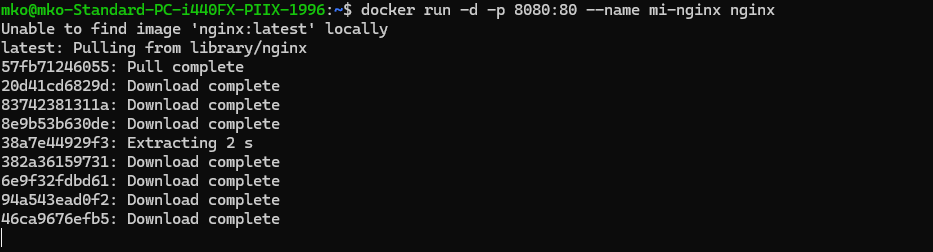

- `-d` → ejecuta en segundo plano (detached)
- `-p 8080:80` → mapea el puerto 8080 del host al 80 del contenedor
- `--name mi-nginx` → asigna un nombre al contenedor

Abre el navegador en `http://localhost:8080` para ver la página de bienvenida de Nginx.

Para parar y eliminar el contenedor:

```bash
docker stop mi-nginx
docker rm mi-nginx
```

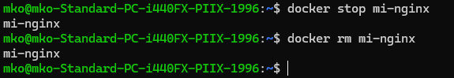

---

## Referencias

- [Documentación oficial de Docker](https://docs.docker.com/engine/install/ubuntu/)
- [Docker Hub](https://hub.docker.com/)
