# Módulo 3: Introducción a los contenedores Docker

> Curso Docker IES — [josedom24/curso_docker_ies](https://github.com/josedom24/curso_docker_ies)

## Índice

1. [Ejemplo 1: Despliegue de GuestBook](#ejemplo-1-despliegue-de-guestbook)
2. [Ejemplo 2: Despliegue de Temperaturas](#ejemplo-2-despliegue-de-temperaturas)
3. [Ejemplo 3: Despliegue de WordPress + MariaDB](#ejemplo-3-despliegue-de-wordpress--mariadb)
4. [Ejemplo 4: Despliegue de Tomcat + Nginx](#ejemplo-4-despliegue-de-tomcat--nginx)

---

## Ejemplo 1: Despliegue de GuestBook

La aplicación **GuestBook** es una web en Python que guarda información en una base de datos Redis. Necesita dos contenedores conectados en la misma red:

- `iesgn/guestbook` → servidor web en el puerto `5000/tcp`
- `redis` → base de datos NoSQL en el puerto `6379/tcp`

### Crear la red

```bash
docker network create red_guestbook
```

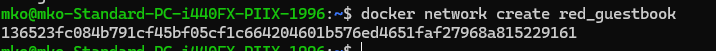

### Crear el contenedor Redis (con persistencia)

```bash
docker run -d --name redis \
              --network red_guestbook \
              -v /opt/redis:/data \
              redis redis-server --appendonly yes
```

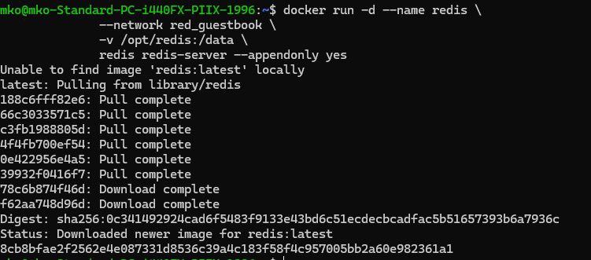

### Crear el contenedor GuestBook

```bash
docker run -d -p 80:5000 \
              --name guestbook \
              --network red_guestbook \
              iesgn/guestbook
```

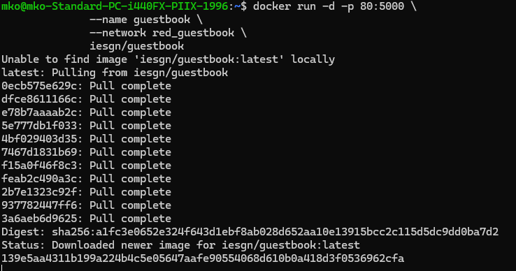

### Verificar los contenedores

```bash
docker ps
```

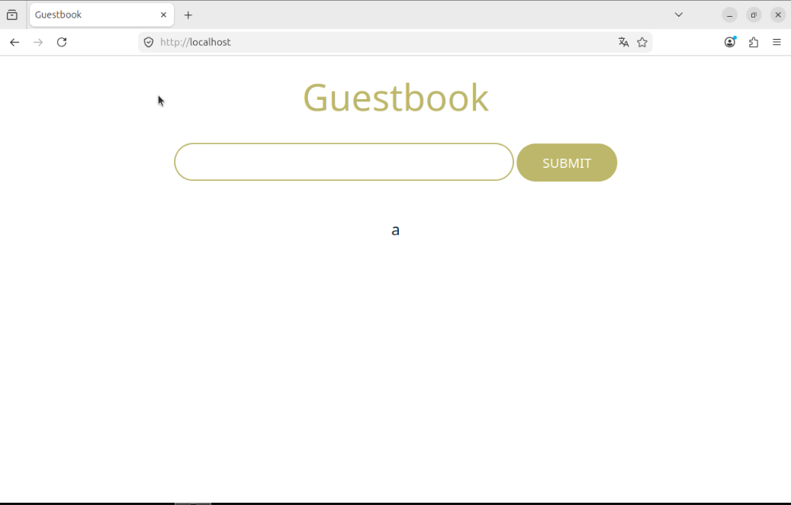

Accede en el navegador a `http://localhost` para ver la aplicación.

### Observaciones

- No hace falta mapear el puerto de Redis porque no se accede desde el exterior; solo lo usa GuestBook internamente a través de la red compartida.
- Al llamar `redis` al contenedor, Docker crea automáticamente una entrada DNS con ese nombre, que es el que usa GuestBook por defecto para conectarse.
- Si se elimina y recrea el contenedor Redis, los datos persisten gracias al volumen montado en `/opt/redis`.

### Configuración avanzada: cambiar el nombre del servidor Redis

Si el contenedor Redis se crea con otro nombre (p. ej. `contenedor_redis`), hay que indicárselo a GuestBook mediante una variable de entorno:

```bash
docker run -d --name contenedor_redis \
              --network red_guestbook \
              -v /opt/redis:/data \
              redis redis-server --appendonly yes

docker run -d -p 80:5000 \
              --name guestbook \
              -e REDIS_SERVER=contenedor_redis \
              --network red_guestbook \
              iesgn/guestbook
```

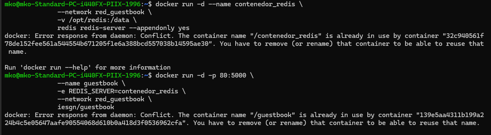

---

## Ejemplo 2: Despliegue de Temperaturas

La aplicación **Temperaturas** permite consultar las temperaturas mínimas y máximas de los municipios de España. Está formada por dos microservicios:

- `iesgn/temperaturas_frontend` → interfaz web en el puerto `3000/tcp`
- `iesgn/temperaturas_backend` → API REST en el puerto `5000/tcp`

El frontend se conecta al backend usando el nombre `temperaturas-backend`.

### Crear la red

```bash
docker network create red_temperaturas
```

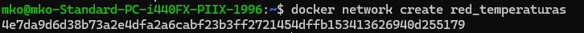

### Crear el contenedor Backend

```bash
docker run -d --name temperaturas-backend \
              --network red_temperaturas \
              iesgn/temperaturas_backend
```

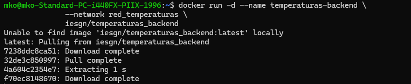

### Crear el contenedor Frontend

```bash
docker run -d -p 80:3000 \
              --name temperaturas-frontend \
              --network red_temperaturas \
              iesgn/temperaturas_frontend
```

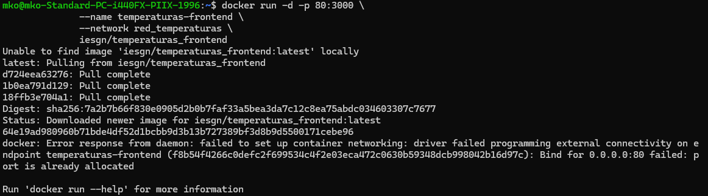

### Verificar los contenedores

```bash
docker ps
```

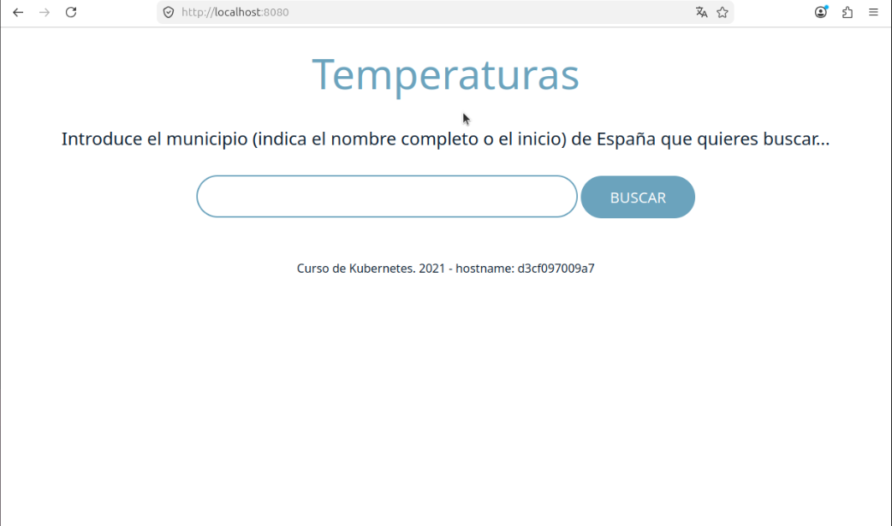

Accede en `http://localhost` para usar la aplicación.

### Observaciones

- Esta es una **aplicación sin estado**: no necesita volúmenes porque no guarda datos.
- El puerto del backend no se mapea al exterior; solo lo usa el frontend internamente.
- La variable de entorno `TEMP_SERVER` del frontend controla a qué backend conectarse (por defecto `temperaturas-backend:5000`).

### Configuración avanzada: cambiar el nombre del backend

```bash
docker run -d --name temperaturas-api \
              --network red_temperaturas \
              iesgn/temperaturas_backend

docker run -d -p 80:3000 \
              --name temperaturas-frontend \
              -e TEMP_SERVER=temperaturas-api:5000 \
              --network red_temperaturas \
              iesgn/temperaturas_frontend
```

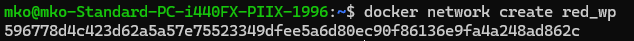

---

## Ejemplo 3: Despliegue de WordPress + MariaDB

Despliegue completo de **WordPress** con base de datos **MariaDB**, cada uno en su propio contenedor conectados por una red interna.

### Crear la red

```bash
docker network create red_wp
```

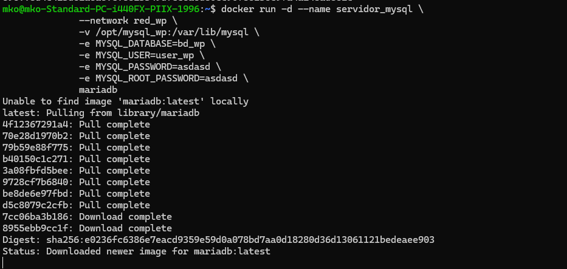

### Crear el contenedor MariaDB

```bash
docker run -d --name servidor_mysql \
              --network red_wp \
              -v /opt/mysql_wp:/var/lib/mysql \
              -e MYSQL_DATABASE=bd_wp \
              -e MYSQL_USER=user_wp \
              -e MYSQL_PASSWORD=asdasd \
              -e MYSQL_ROOT_PASSWORD=asdasd \
              mariadb
```

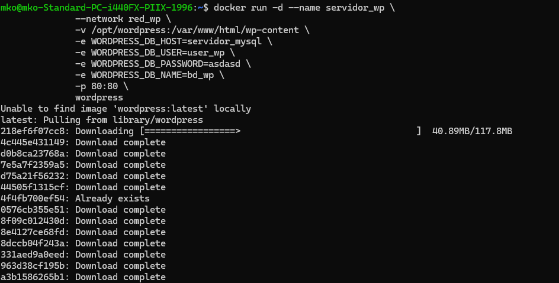

### Crear el contenedor WordPress

```bash
docker run -d --name servidor_wp \
              --network red_wp \
              -v /opt/wordpress:/var/www/html/wp-content \
              -e WORDPRESS_DB_HOST=servidor_mysql \
              -e WORDPRESS_DB_USER=user_wp \
              -e WORDPRESS_DB_PASSWORD=asdasd \
              -e WORDPRESS_DB_NAME=bd_wp \
              -p 80:80 \
              wordpress
```

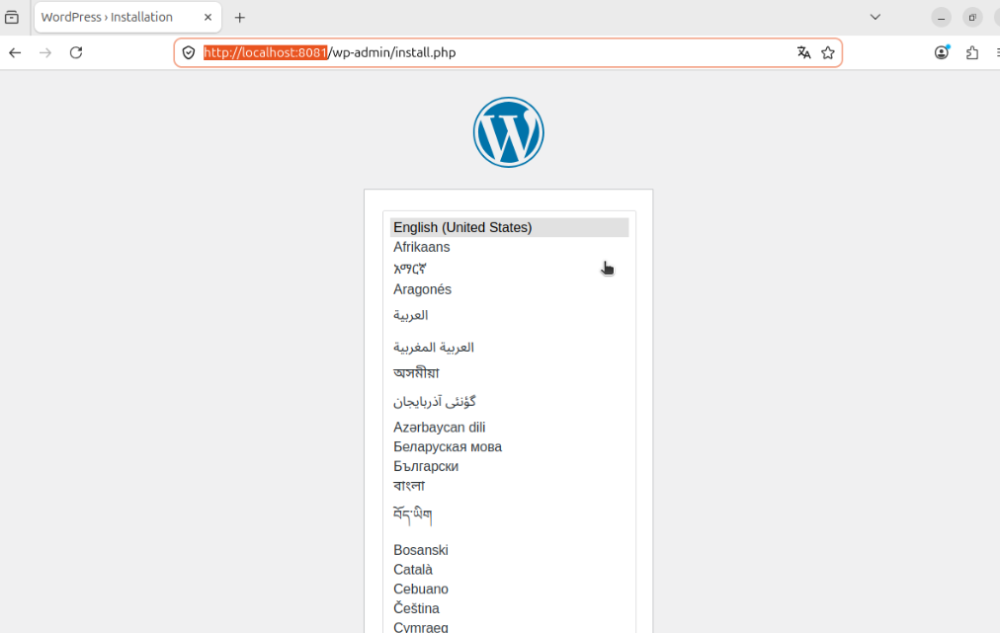

### Verificar los contenedores

```bash
docker ps
```

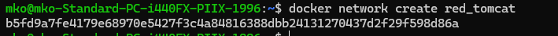

Accede en `http://localhost` para completar la instalación de WordPress.

### Observaciones

- Las variables de entorno configuran automáticamente tanto MariaDB (crea el usuario y la base de datos) como WordPress (genera el fichero `wp-config.php`), por lo que no hace falta introducirlas manualmente durante la instalación.
- La variable `WORDPRESS_DB_HOST` debe coincidir con el nombre del contenedor MySQL (`servidor_mysql`), que es resuelto por el DNS interno de Docker.
- El puerto 3306 de MariaDB no se mapea al exterior; WordPress accede a él internamente a través de la red compartida.
- Los datos de la base de datos persisten en `/opt/mysql_wp` y los ficheros de WordPress en `/opt/wordpress`.

---

## Ejemplo 4: Despliegue de Tomcat + Nginx

Despliegue de una aplicación Java en **Tomcat** expuesta al exterior a través de un **proxy inverso Nginx**.

### Crear la red

```bash
docker network create red_tomcat
```

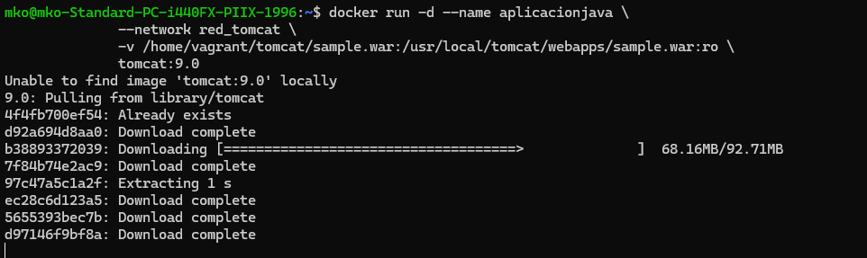

### Preparar los ficheros necesarios

Dentro del directorio de trabajo debe haber:

```
tomcat/
├── sample.war       # Aplicación Java a desplegar
└── default.conf     # Configuración de Nginx como proxy inverso
```

Contenido de `default.conf`:

```nginx
server {
    listen       80;
    listen  [::]:80;
    server_name  localhost;

    location / {
        root   /usr/share/nginx/html;
        proxy_pass http://aplicacionjava:8080/sample/;
    }

    error_page   500 502 503 504  /50x.html;
    location = /50x.html {
        root   /usr/share/nginx/html;
    }
}
```

### Crear el contenedor Tomcat

```bash
docker run -d --name aplicacionjava \
              --network red_tomcat \
              -v /home/vagrant/tomcat/sample.war:/usr/local/tomcat/webapps/sample.war:ro \
              tomcat:9.0
```

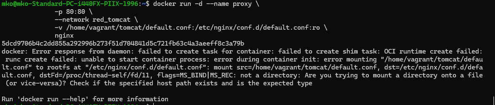

### Crear el contenedor Nginx (proxy inverso)

```bash
docker run -d --name proxy \
              -p 80:80 \
              --network red_tomcat \
              -v /home/vagrant/tomcat/default.conf:/etc/nginx/conf.d/default.conf:ro \
              nginx
```


### Verificar los contenedores

```bash
docker ps
```


Accede en `http://localhost` para ver la aplicación Java desplegada en Tomcat a través del proxy Nginx.

### Observaciones

- Tomcat **no mapea puerto** al exterior; solo es accesible desde Nginx a través de la red interna.
- Nginx actúa como proxy inverso redirigiendo las peticiones del puerto 80 al puerto 8080 de Tomcat usando el nombre de contenedor `aplicacionjava` como hostname.
- Se usa **bind mount** (`:ro`) para montar el fichero `.war` y la configuración de Nginx sin incluirlos en las imágenes.

---

## Referencias

- [Repositorio del curso](https://github.com/josedom24/curso_docker_ies)
- [Docker Hub](https://hub.docker.com/)
- [Documentación oficial de Docker](https://docs.docker.com/)
