# Docker — Práctica 3: Imágenes y contenedores

## Índice

1. [Descargar imagen de Ubuntu](#1-descargar-imagen-de-ubuntu)
2. [Descargar imagen de Hello-World](#2-descargar-imagen-de-hello-world)
3. [Descargar imagen de Nginx](#3-descargar-imagen-de-nginx)
4. [Listar todas las imágenes](#4-listar-todas-las-imágenes)
5. [Ejecutar contenedor myhello1](#5-ejecutar-contenedor-myhello1)
6. [Ejecutar contenedor myhello2](#6-ejecutar-contenedor-myhello2)
7. [Ejecutar contenedor myhello3](#7-ejecutar-contenedor-myhello3)
8. [Mostrar contenedores en ejecución](#8-mostrar-contenedores-en-ejecución)
9. [Parar myhello1](#9-parar-myhello1)
10. [Parar myhello2](#10-parar-myhello2)
11. [Borrar myhello1](#11-borrar-myhello1)
12. [Mostrar contenedores en ejecución](#12-mostrar-contenedores-en-ejecución)
13. [Borrar todos los contenedores](#13-borrar-todos-los-contenedores)

---

## 1. Descargar imagen de Ubuntu

```bash
docker pull ubuntu
```

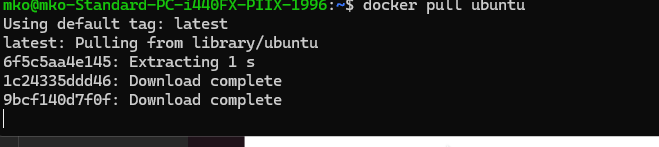

---

## 2. Descargar imagen de Hello-World

```bash
docker pull hello-world
```

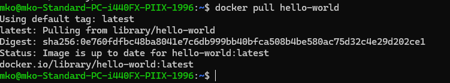

---

## 3. Descargar imagen de Nginx

```bash
docker pull nginx
```

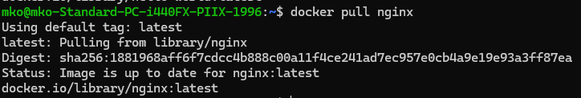

---

## 4. Listar todas las imágenes

```bash
docker images
```

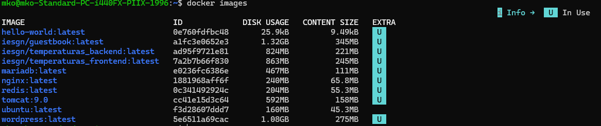

---

## 5. Ejecutar contenedor myhello1

```bash
docker run --name myhello1 hello-world
```

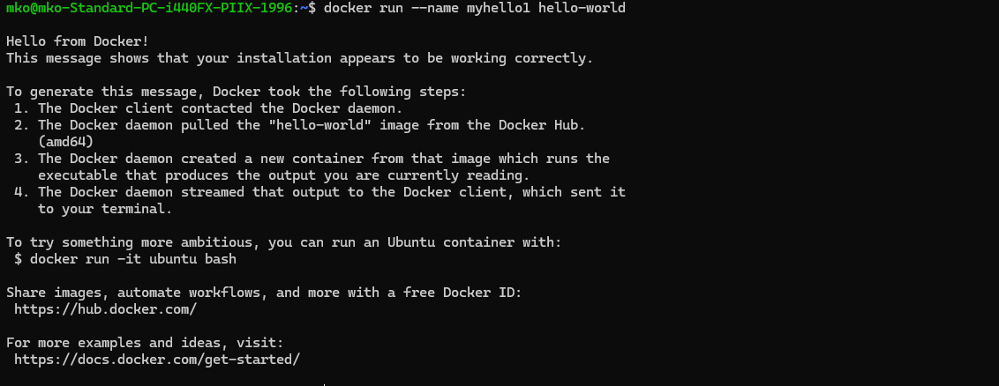

---

## 6. Ejecutar contenedor myhello2

```bash
docker run --name myhello2 hello-world
```

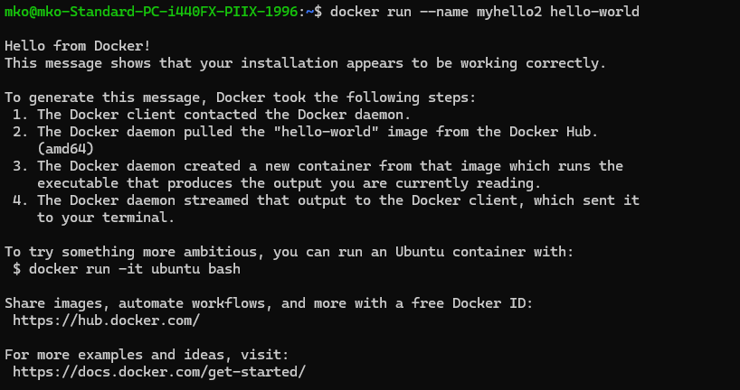

---

## 7. Ejecutar contenedor myhello3

```bash
docker run --name myhello3 hello-world
```

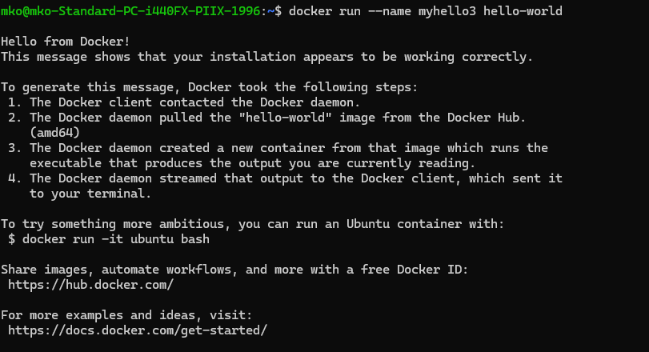

---

## 8. Mostrar contenedores en ejecución

```bash
docker ps -a
```

> Se usa `-a` para ver también los contenedores parados, ya que `hello-world` termina nada más ejecutarse.

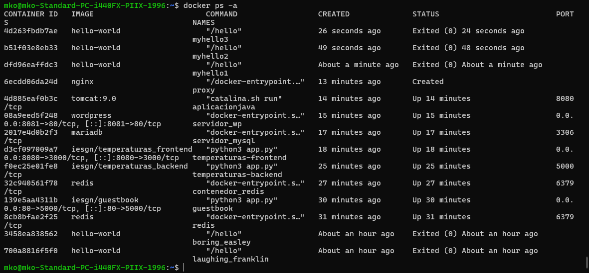

---

## 9. Parar myhello1

```bash
docker stop myhello1
```

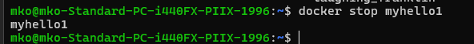

---

## 10. Parar myhello2

```bash
docker stop myhello2
```

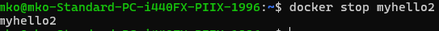

---

## 11. Borrar myhello1

```bash
docker rm myhello1
```


---

## 12. Mostrar contenedores en ejecución

```bash
docker ps -a
```

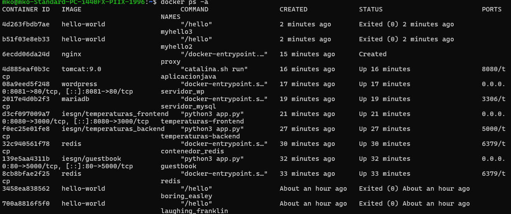

---

## 13. Borrar todos los contenedores

```bash
docker rm $(docker ps -aq)
```

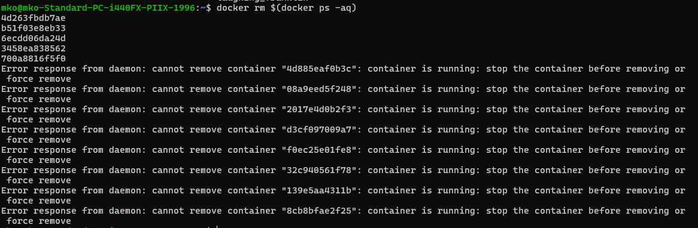

---

## Referencias

- [Pull docker images & run docker containers](http://www.servermom.org/pull-docker-images-run-docker-containers/3225/)
- [Borrar imágenes y contenedores Docker](https://www.tecmint.com/remove-docker-images-containers-and-volumes/)
- [Dar nombre a contenedores Docker](https://www.tecmint.com/name-docker-containers/)
