# Módulo: Almacenamiento y Redes en Docker

> Curso Docker IES — [josedom24/curso_docker_ies](https://github.com/josedom24/curso_docker_ies)

## Índice

1. [Ejemplo 1: Volúmenes Docker](#ejemplo-1-volúmenes-docker)
2. [Ejemplo 2: Bind Mount](#ejemplo-2-bind-mount)
3. [Ejemplo 3: Redes definidas por el usuario](#ejemplo-3-redes-definidas-por-el-usuario)

---

## Conceptos previos

Los contenedores son **efímeros**: los datos que contienen se pierden cuando el contenedor se elimina. Docker ofrece dos soluciones para persistir datos:

- **Volúmenes Docker**: gestionados por Docker, almacenados en `/var/lib/docker/volumes`. Solo Docker debe acceder a ellos.
- **Bind mount**: vinculan un directorio del host directamente al contenedor. Pueden ser accedidos y modificados desde fuera del contenedor.

En cuanto a redes, Docker crea por defecto una red `bridge`, pero las **redes definidas por el usuario** son preferibles en producción porque ofrecen resolución DNS entre contenedores, mayor aislamiento y más control.

---

## Ejemplo 1: Volúmenes Docker

En este ejemplo usamos un volumen Docker para que los datos de un servidor web Apache persistan aunque el contenedor se elimine.

### Crear el volumen

```bash
docker volume create miweb
```

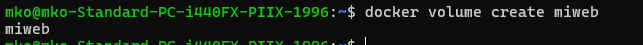

### Listar los volúmenes

```bash
docker volume ls
```

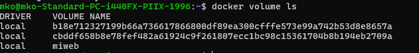

### Crear el contenedor Apache con el volumen montado

```bash
docker run -d --name my-apache-app \
              -v miweb:/usr/local/apache2/htdocs \
              -p 8080:80 \
              httpd:2.4
```

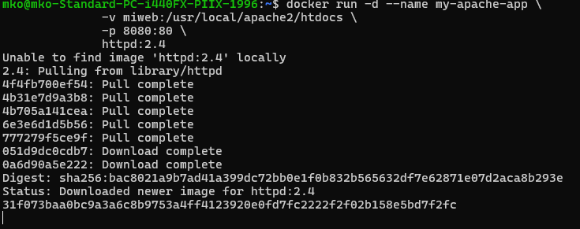

### Crear un fichero index.html dentro del contenedor

```bash
docker exec my-apache-app bash -c 'echo "<h1>Hola desde volumen Docker</h1>" > /usr/local/apache2/htdocs/index.html'
```

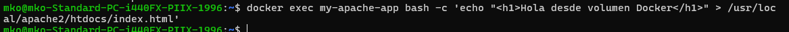

### Comprobar que sirve el fichero

```bash
curl http://localhost:8080
```

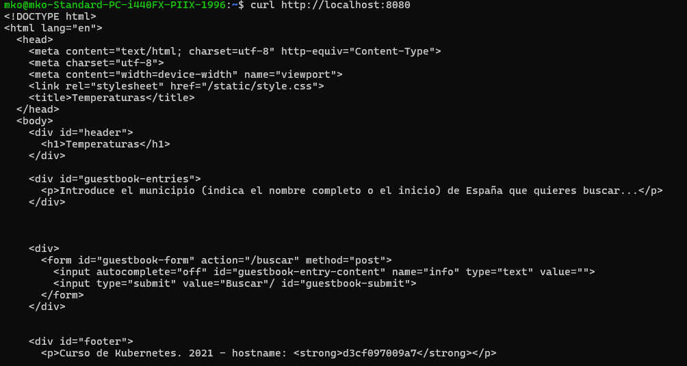

### Eliminar el contenedor

```bash
docker rm -f my-apache-app
```

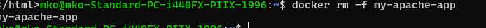

### Crear un nuevo contenedor con el mismo volumen

```bash
docker run -d --name my-apache-app \
              -v miweb:/usr/local/apache2/htdocs \
              -p 8080:80 \
              httpd:2.4
```

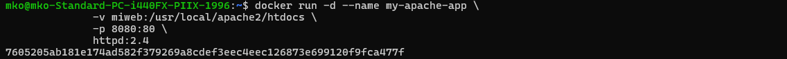

### Verificar que los datos persisten

```bash
curl http://localhost:8080
```

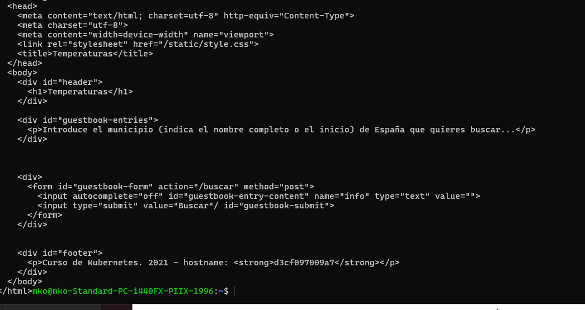

> Los datos siguen ahí aunque el contenedor anterior fue eliminado. El volumen Docker ha mantenido la persistencia.

---

## Ejemplo 2: Bind Mount

En este ejemplo montamos un directorio del host directamente en el contenedor. Cualquier cambio en el host se refleja de inmediato en el contenedor.

### Crear el directorio y el fichero en el host

```bash
mkdir ~/web
echo "<h1>Hola desde Bind Mount</h1>" > ~/web/index.html
```


### Crear el contenedor con bind mount

```bash
docker run -d --name my-apache-app \
              -v ~/web:/usr/local/apache2/htdocs \
              -p 8080:80 \
              httpd:2.4
```

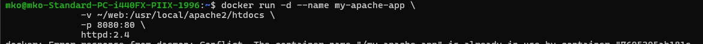

### Comprobar que sirve el fichero del host

```bash
curl http://localhost:8080
```

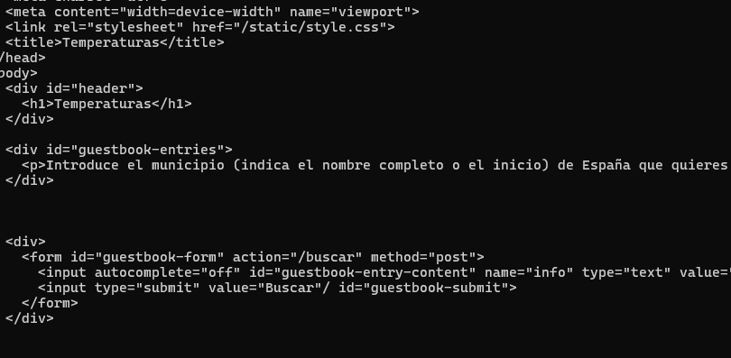

### Modificar el fichero desde el host

```bash
echo "<h1>Contenido actualizado desde el host</h1>" > ~/web/index.html
```

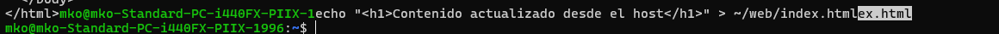

### Verificar que el cambio se refleja en el contenedor

```bash
curl http://localhost:8080
```


> El contenedor sirve el nuevo contenido de forma inmediata, sin necesidad de reiniciarlo.

### Eliminar el contenedor y comprobar que el fichero sigue en el host

```bash
docker rm -f my-apache-app
ls ~/web
cat ~/web/index.html
```

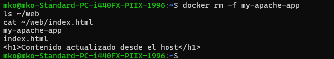

> Con bind mount los datos quedan en el host y no se pierden al borrar el contenedor.

---

## Ejemplo 3: Redes definidas por el usuario

Las redes definidas por el usuario permiten que los contenedores se comuniquen entre sí usando sus **nombres** como hostnames (resolución DNS automática), sin necesidad de conocer sus IPs.

### Listar las redes existentes

```bash
docker network ls
```

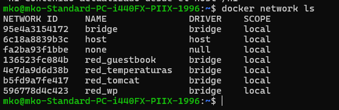

### Crear una red bridge definida por el usuario

```bash
docker network create red1
```

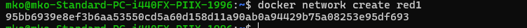

### Inspeccionar la red para ver su configuración

```bash
docker network inspect red1
```

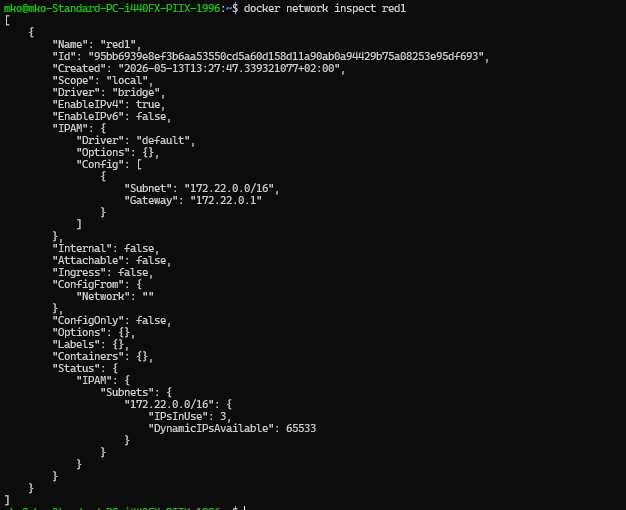

### Crear un contenedor Apache conectado a la red

```bash
docker run -d --name my-apache-app \
              --network red1 \
              -p 8080:80 \
              httpd:2.4
```

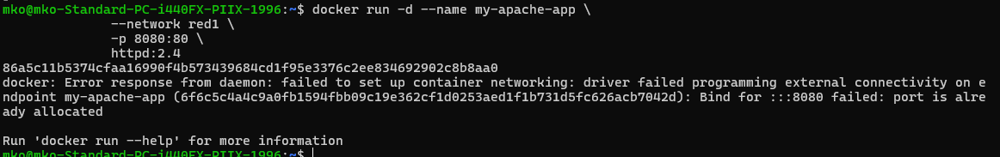

### Crear un segundo contenedor Debian en la misma red

```bash
docker run -it --name contenedor1 \
               --network red1 \
               debian bash
```

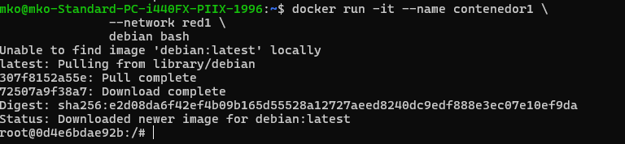

### Desde contenedor1: instalar herramientas DNS y comprobar resolución

```bash
apt update && apt install -y dnsutils
dig my-apache-app
```

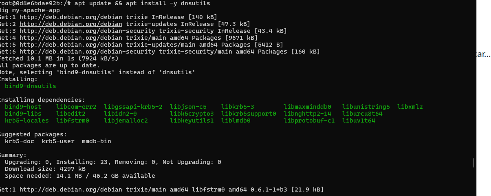

> Docker resuelve automáticamente el nombre `my-apache-app` a su IP interna gracias al servidor DNS interno (`127.0.0.11`).

### Comprobar la configuración DNS del contenedor

```bash
cat /etc/resolv.conf
```

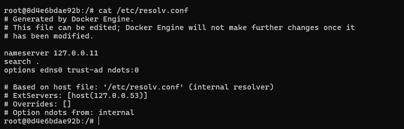

### Conectar un contenedor a una red en caliente

```bash
docker network connect red1 contenedor1
```


### Eliminar la red (primero hay que parar los contenedores)

```bash
docker rm -f my-apache-app contenedor1
docker network rm red1
```

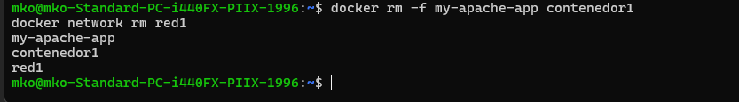

---

## Resumen de comandos útiles

| Comando | Descripción |
|---|---|
| `docker volume create <nombre>` | Crea un volumen Docker |
| `docker volume ls` | Lista los volúmenes |
| `docker volume rm <nombre>` | Elimina un volumen |
| `docker volume inspect <nombre>` | Información detallada del volumen |
| `docker network create <nombre>` | Crea una red definida por el usuario |
| `docker network ls` | Lista las redes |
| `docker network inspect <nombre>` | Información detallada de la red |
| `docker network connect <red> <contenedor>` | Conecta un contenedor a una red en caliente |
| `docker network disconnect <red> <contenedor>` | Desconecta un contenedor de una red |
| `docker network rm <nombre>` | Elimina una red |

---

## Referencias

- [Repositorio del curso](https://github.com/josedom24/curso_docker_ies)
- [Documentación oficial: Volumes](https://docs.docker.com/storage/volumes/)
- [Documentación oficial: Networking](https://docs.docker.com/network/)
