# Módulo 4: Creando escenarios multicontenedor con Docker Compose

> Curso Docker IES — [josedom24/curso_docker_ies](https://github.com/josedom24/curso_docker_ies)

## Índice

1. [Introducción a Docker Compose](#introducción-a-docker-compose)
2. [Ejemplo 1: GuestBook con Docker Compose](#ejemplo-1-guestbook-con-docker-compose)
3. [Ejemplo 2: Temperaturas con Docker Compose](#ejemplo-2-temperaturas-con-docker-compose)
4. [Ejemplo 3: WordPress + MariaDB con Docker Compose](#ejemplo-3-wordpress--mariadb-con-docker-compose)

---

## Introducción a Docker Compose

**Docker Compose** permite definir y levantar escenarios multicontenedor desde un único fichero `docker-compose.yml`. En lugar de ejecutar varios `docker run` manualmente, se describe todo el escenario (servicios, redes, volúmenes) en YAML y se gestiona con un solo comando.

Al crear un escenario con `docker compose` se crea automáticamente una **red bridge definida por el usuario**, por lo que los contenedores se pueden comunicar entre sí usando el nombre del servicio como hostname (DNS automático).

### Comandos principales

| Comando | Descripción |
|---|---|
| `docker compose up -d` | Crea y arranca todos los contenedores en segundo plano |
| `docker compose down` | Para y elimina contenedores y redes |
| `docker compose down -v` | Igual que el anterior, también elimina volúmenes |
| `docker compose ps` | Lista los contenedores del escenario |
| `docker compose stop` | Para los contenedores sin eliminarlos |
| `docker compose start` | Arranca contenedores parados |
| `docker compose logs -f` | Muestra los logs en tiempo real |
| `docker compose exec <servicio> bash` | Abre una shell en un contenedor |
| `docker compose top` | Muestra los procesos de cada contenedor |

---

## Ejemplo 1: GuestBook con Docker Compose

Desplegamos la aplicación GuestBook (web Python + Redis) con un único fichero `docker-compose.yml`, sin necesidad de crear la red manualmente.

### Crear el directorio y el fichero

```bash
mkdir guestbook
cd guestbook
nano docker-compose.yml
```


### Contenido del fichero `docker-compose.yml`

```yaml
version: '3.1'
services:
  app:
    container_name: guestbook
    image: iesgn/guestbook
    restart: always
    ports:
      - 80:5000
  db:
    container_name: redis
    image: redis
    restart: always
```

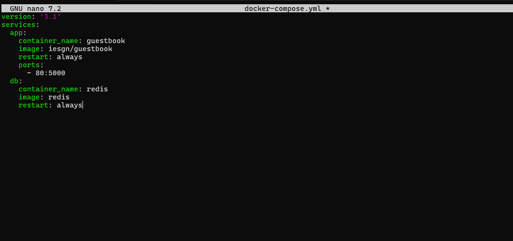

### Levantar el escenario

```bash
docker compose up -d
```

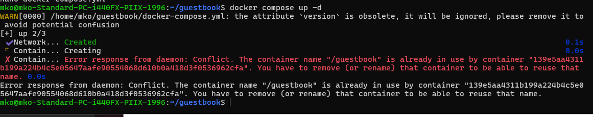

### Ver los contenedores en ejecución

```bash
docker compose ps
```

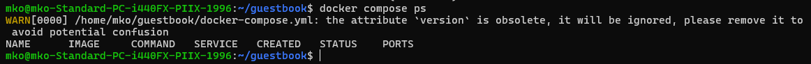

Accede en el navegador a `http://localhost` para ver la aplicación GuestBook funcionando.

### Ver los logs

```bash
docker compose logs
```

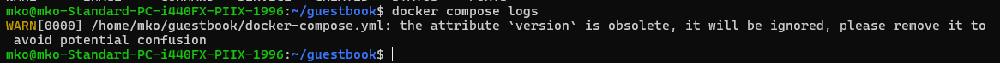

### Parar el escenario

```bash
docker compose stop
```

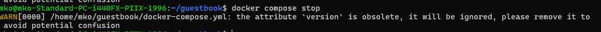

### Eliminar el escenario

```bash
docker compose down
```

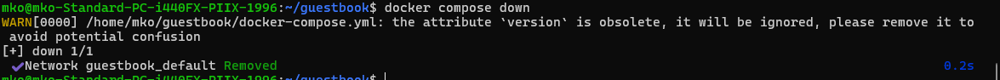

### Observaciones

- Docker Compose crea automáticamente la red `guestbook_default` y conecta los dos contenedores a ella.
- El servicio `db` es accesible desde `app` usando el nombre `db` como hostname gracias al DNS interno.
- Con `restart: always` los contenedores se reiniciarán automáticamente si se paran o si el sistema reinicia.

---

## Ejemplo 2: Temperaturas con Docker Compose

Desplegamos la aplicación Temperaturas (frontend Python + backend API REST) con `depends_on` para controlar el orden de arranque.

### Crear el directorio y el fichero

```bash
mkdir temperaturas
cd temperaturas
nano docker-compose.yml
```

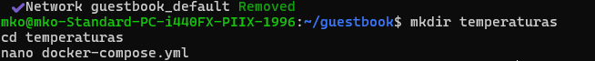

### Contenido del fichero `docker-compose.yml`

```yaml
version: '3.1'
services:
  frontend:
    container_name: temperaturas-frontend
    image: iesgn/temperaturas_frontend
    restart: always
    ports:
      - 80:3000
    depends_on:
      - backend
  backend:
    container_name: temperaturas-backend
    image: iesgn/temperaturas_backend
    restart: always
```

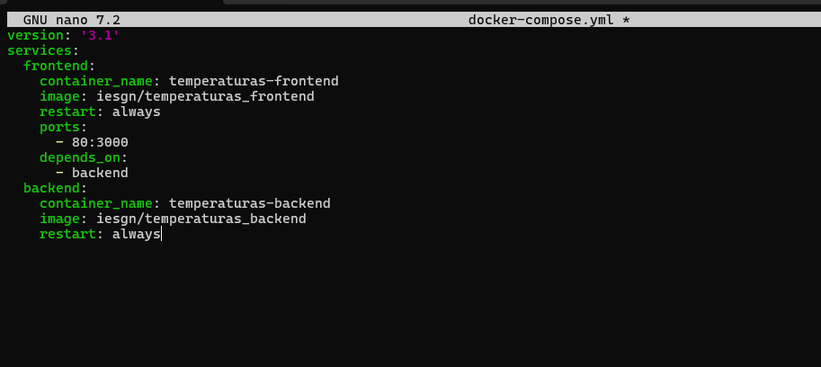

### Levantar el escenario

```bash
docker compose up -d
```

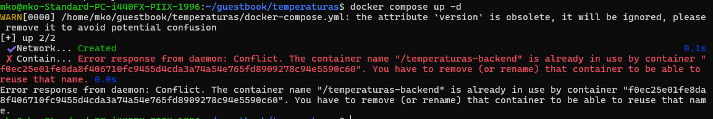

### Ver los contenedores en ejecución

```bash
docker compose ps
```

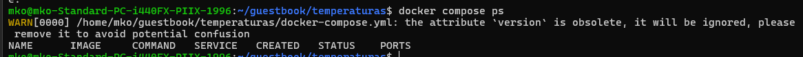

Accede en `http://localhost` para consultar temperaturas de municipios de España.

### Ver los procesos de cada contenedor

```bash
docker compose top
```

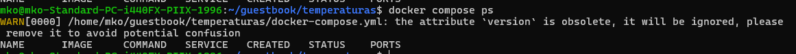

### Eliminar el escenario

```bash
docker compose down
```

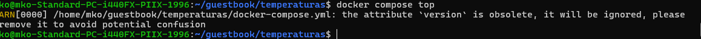

### Observaciones

- `depends_on: - backend` garantiza que el contenedor `backend` arranque antes que `frontend`.
- El frontend localiza el backend usando el nombre de servicio `backend` como hostname, sin necesidad de conocer su IP.
- Al ser una aplicación sin estado, no se necesitan volúmenes.

---

## Ejemplo 3: WordPress + MariaDB con Docker Compose

Desplegamos WordPress con su base de datos MariaDB usando volúmenes Docker para la persistencia de los datos.

### Crear el directorio y el fichero

```bash
mkdir wordpress
cd wordpress
nano docker-compose.yml
```

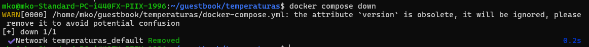

### Contenido del fichero `docker-compose.yml`

```yaml
version: '3.1'
services:
  wordpress:
    container_name: servidor_wp
    image: wordpress
    restart: always
    environment:
      WORDPRESS_DB_HOST: db
      WORDPRESS_DB_USER: user_wp
      WORDPRESS_DB_PASSWORD: asdasd
      WORDPRESS_DB_NAME: bd_wp
    ports:
      - 80:80
    volumes:
      - wordpress_data:/var/www/html/wp-content
  db:
    container_name: servidor_mysql
    image: mariadb
    restart: always
    environment:
      MYSQL_DATABASE: bd_wp
      MYSQL_USER: user_wp
      MYSQL_PASSWORD: asdasd
      MYSQL_ROOT_PASSWORD: asdasd
    volumes:
      - mariadb_data:/var/lib/mysql
volumes:
  wordpress_data:
  mariadb_data:
```

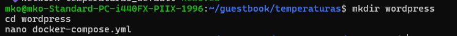

### Levantar el escenario

```bash
docker compose up -d
```

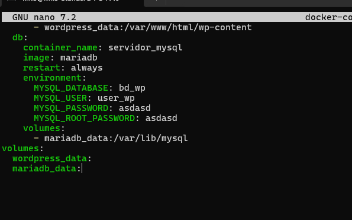

### Ver los contenedores en ejecución

```bash
docker compose ps
```

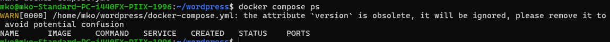

Accede en `http://localhost` para completar la instalación de WordPress.

### Comprobar los volúmenes creados

```bash
docker volume ls
```

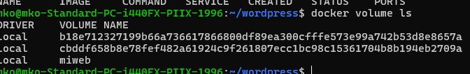

### Parar los contenedores sin borrar los datos

```bash
docker compose stop
```

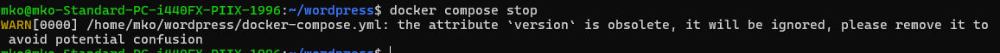

### Volver a arrancarlos (los datos persisten)

```bash
docker compose start
```

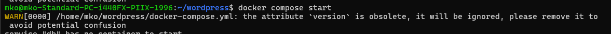

### Eliminar el escenario completo incluyendo volúmenes

```bash
docker compose down -v
```

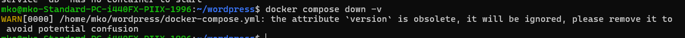

### Observaciones

- Los volúmenes `wordpress_data` y `mariadb_data` son gestionados por Docker y persisten aunque los contenedores se eliminen.
- Con `docker compose stop` + `docker compose start` los datos se mantienen. Solo se pierden con `down -v`.
- La variable `WORDPRESS_DB_HOST: db` apunta al servicio `db`, que Docker resuelve automáticamente por DNS.

---

## Referencias

- [Repositorio del curso](https://github.com/josedom24/curso_docker_ies)
- [Documentación oficial Docker Compose](https://docs.docker.com/compose/)
- [Referencia del fichero docker-compose.yml](https://docs.docker.com/compose/compose-file/)
