# Módulo 5: Creación de imágenes Docker

> Curso Docker IES — [josedom24/curso_docker_ies](https://github.com/josedom24/curso_docker_ies)

## Índice

1. [Introducción al Dockerfile](#introducción-al-dockerfile)
2. [Ejemplo 1: Imagen con página web estática](#ejemplo-1-imagen-con-página-web-estática)
3. [Ejemplo 2: Imagen con aplicación PHP](#ejemplo-2-imagen-con-aplicación-php)
4. [Ejemplo 3: Imagen con aplicación Python (Flask)](#ejemplo-3-imagen-con-aplicación-python-flask)

---

## Introducción al Dockerfile

Un `Dockerfile` es un fichero de texto con instrucciones que Docker ejecuta secuencialmente para construir una imagen. Cada instrucción crea una nueva capa en la imagen.

### Instrucciones principales

| Instrucción | Descripción |
|---|---|
| `FROM` | Imagen base sobre la que se construye |
| `RUN` | Ejecuta un comando durante la construcción |
| `COPY` / `ADD` | Copia ficheros del host a la imagen |
| `WORKDIR` | Establece el directorio de trabajo |
| `EXPOSE` | Documenta el puerto que usará el contenedor |
| `ENV` | Define variables de entorno |
| `CMD` | Comando por defecto al arrancar el contenedor |
| `ENTRYPOINT` | Ejecutable fijo al arrancar el contenedor |
| `LABEL` | Añade metadatos a la imagen |

### Comando de construcción

```bash
docker build -t usuario/nombre:version .
```

El `.` indica que el contexto (directorio con el `Dockerfile` y los ficheros necesarios) es el directorio actual.

---

## Ejemplo 1: Imagen con página web estática

Construimos una imagen con Apache que sirve una página HTML estática. Se muestran dos versiones: desde Debian base y desde una imagen de Apache ya preparada.

### Preparar el contexto

```bash
mkdir ejemplo1
cd ejemplo1
mkdir public_html
echo "<h1>Hola desde mi imagen Docker</h1>" > public_html/index.html
nano Dockerfile
```

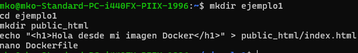

### Versión 1: Desde imagen base Debian

Contenido del `Dockerfile`:

```dockerfile
FROM debian
RUN apt-get update && apt-get install -y apache2 && \
    apt-get clean && rm -rf /var/lib/apt/lists/*
ADD public_html /var/www/html/
EXPOSE 80
CMD ["/usr/sbin/apache2ctl", "-D", "FOREGROUND"]
```

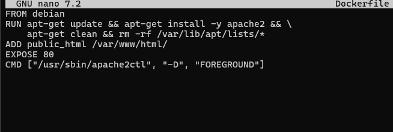

### Construir la imagen v1

```bash
docker build -t tuusuario/ejemplo1:v1 .
```

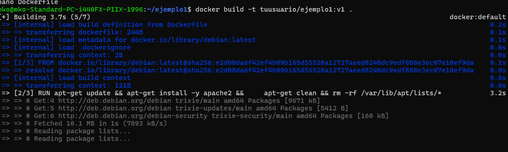

### Comprobar que se ha creado

```bash
docker images
```

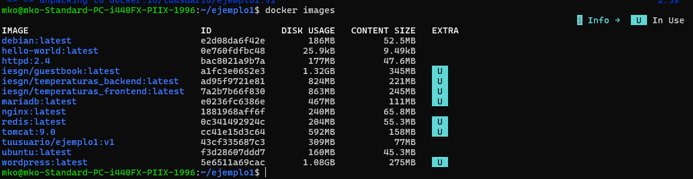

### Crear y probar el contenedor v1

```bash
docker run -d -p 80:80 --name ejemplo1 tuusuario/ejemplo1:v1
```

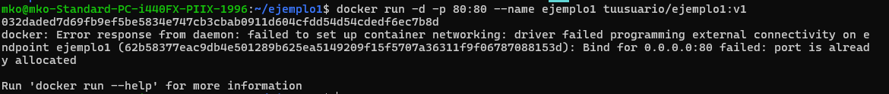

Accede en `http://localhost` para ver la página.

### Versión 2: Desde imagen httpd (Apache ya instalado)

Modifica el `Dockerfile`:

```dockerfile
FROM httpd:2.4
ADD public_html /usr/local/apache2/htdocs/
EXPOSE 80
```


### Construir la imagen v2

```bash
docker rm -f ejemplo1
docker build -t tuusuario/ejemplo1:v2 .
docker run -d -p 80:80 --name ejemplo1 tuusuario/ejemplo1:v2
```

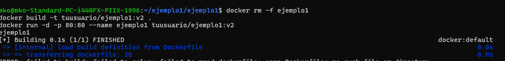

> Con `httpd:2.4` no hace falta instalar nada ni definir `CMD`, ya que la imagen base ya tiene Apache configurado y en ejecución.

### Eliminar el contenedor

```bash
docker rm -f ejemplo1
```

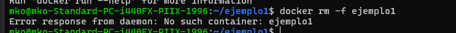

---

## Ejemplo 2: Imagen con aplicación PHP

Construimos una imagen que sirve una aplicación PHP. También en dos versiones: instalando PHP manualmente y usando una imagen oficial con PHP.

### Preparar el contexto

```bash
mkdir ejemplo2
cd ejemplo2
mkdir app
nano app/index.php
nano app/info.php
nano Dockerfile
```

Contenido de `app/index.php`:

```php
<?php
echo "<h1>Aplicación PHP en Docker</h1>";
echo "<p>Versión de PHP: " . phpversion() . "</p>";
?>
```

Contenido de `app/info.php`:

```php
<?php phpinfo(); ?>
```

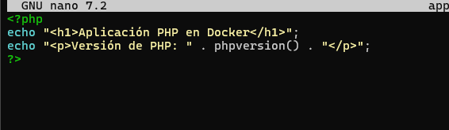

### Versión 1: Desde imagen base Debian

Contenido del `Dockerfile`:

```dockerfile
FROM debian
RUN apt-get update && apt-get install -y apache2 libapache2-mod-php php && \
    apt-get clean && rm -rf /var/lib/apt/lists/*
ADD app /var/www/html/
RUN rm -f /var/www/html/index.html
EXPOSE 80
CMD ["/usr/sbin/apache2ctl", "-D", "FOREGROUND"]
```

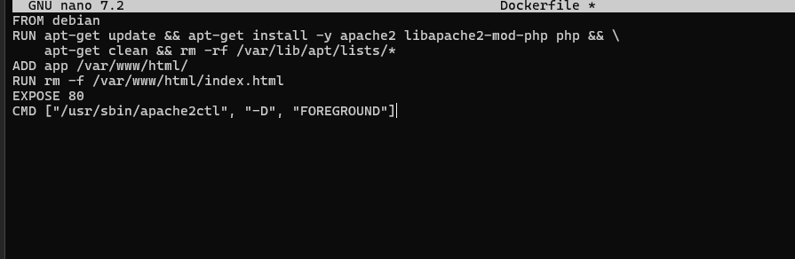

### Construir la imagen v1

```bash
docker build -t tuusuario/ejemplo2:v1 .
```

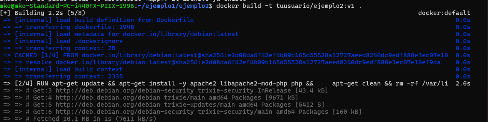

### Crear y probar el contenedor v1

```bash
docker run -d -p 80:80 --name ejemplo2 tuusuario/ejemplo2:v1
```

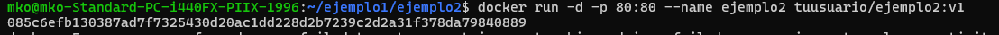

Accede en `http://localhost` y en `http://localhost/info.php` para ver la versión de PHP.

### Versión 2: Desde imagen oficial php:apache

Modifica el `Dockerfile`:

```dockerfile
FROM php:7.4-apache
ADD app /var/www/html/
EXPOSE 80
```


### Construir la imagen v2

```bash
docker rm -f ejemplo2
docker build -t tuusuario/ejemplo2:v2 .
docker run -d -p 80:80 --name ejemplo2 tuusuario/ejemplo2:v2
```

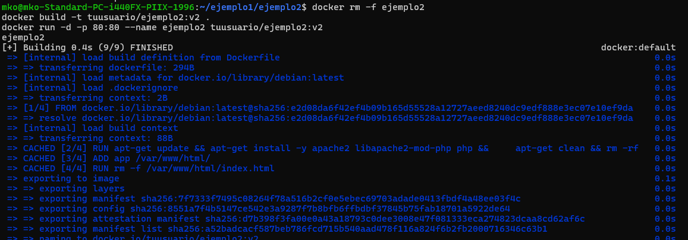

> La imagen `php:7.4-apache` ya incluye Apache y PHP configurados juntos. El `Dockerfile` se reduce a solo 3 líneas.

### Eliminar el contenedor

```bash
docker rm -f ejemplo2
```

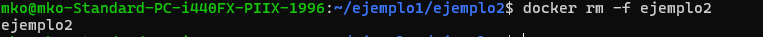

---

## Ejemplo 3: Imagen con aplicación Python (Flask)

Construimos una imagen para servir una aplicación web desarrollada con el framework **Flask** de Python.

### Preparar el contexto

```bash
mkdir ejemplo3
cd ejemplo3
mkdir app
nano app/app.py
nano app/requirements.txt
nano Dockerfile
```

Contenido de `app/app.py`:

```python
from flask import Flask

app = Flask(__name__)

@app.route('/')
def index():
    return '<h1>Aplicación Flask en Docker</h1>'

if __name__ == '__main__':
    app.run(host='0.0.0.0', port=3000, debug=True)
```

Contenido de `app/requirements.txt`:

```
flask
```

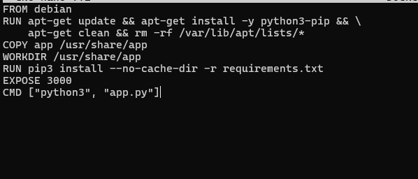

### Contenido del `Dockerfile`

```dockerfile
FROM debian
RUN apt-get update && apt-get install -y python3-pip && \
    apt-get clean && rm -rf /var/lib/apt/lists/*
COPY app /usr/share/app
WORKDIR /usr/share/app
RUN pip3 install --no-cache-dir -r requirements.txt
EXPOSE 3000
CMD ["python3", "app.py"]
```

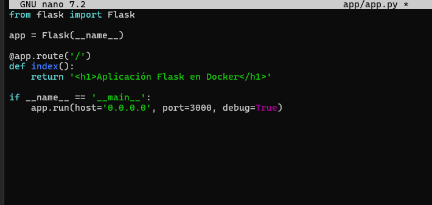

### Construir la imagen

```bash
docker build -t tuusuario/ejemplo3:v1 .
```

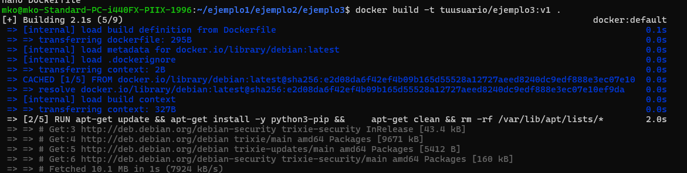

### Comprobar que se ha creado

```bash
docker images
```

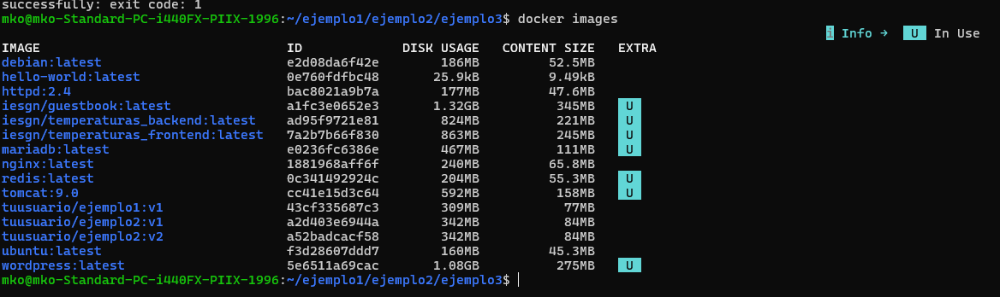

### Crear y probar el contenedor

```bash
docker run -d -p 80:3000 --name ejemplo3 tuusuario/ejemplo3:v1
```

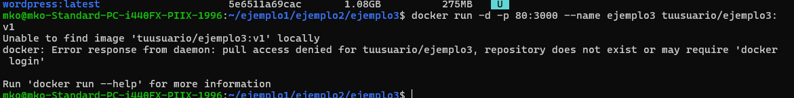

Accede en `http://localhost` para ver la aplicación Flask en funcionamiento.

### Ver los logs del contenedor

```bash
docker logs ejemplo3
```

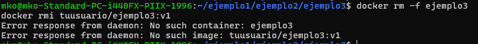

### Eliminar el contenedor e imagen

```bash
docker rm -f ejemplo3
docker rmi tuusuario/ejemplo3:v1
```


---

## Resumen de buenas prácticas con Dockerfile

- Usar `-y` en los comandos `apt-get install` para evitar interacción con el usuario durante el build.
- Limpiar la caché de apt en el mismo `RUN` donde se instala: `&& apt-get clean && rm -rf /var/lib/apt/lists/*`
- Usar imágenes base específicas (`php:7.4-apache`) en lugar de instalar todo desde Debian cuando sea posible.
- Minimizar el número de capas agrupando comandos con `&&`.
- Usar `WORKDIR` en lugar de `cd` dentro de un `RUN`.

---

## Referencias

- [Repositorio del curso](https://github.com/josedom24/curso_docker_ies)
- [Referencia Dockerfile](https://docs.docker.com/engine/reference/builder/)
- [Buenas prácticas Dockerfile](https://docs.docker.com/develop/develop-images/dockerfile_best-practices/)
