# Servidor de Alojamiento Web - Proyecto 2º Trimestre

Este proyecto consiste en la configuración y despliegue de un servidor de alojamiento web completo, integrando servicios de hosting, bases de datos, acceso remoto seguro y automatización.

## 📝 Descripción
**Visión General del Sistema**

El objetivo es crear un entorno de hosting robusto que permita:
- **Hosting Web**: Soporte para sitios HTML y PHP.
- **Bases de Datos**: Gestión con MySQL y administración vía phpMyAdmin.
- **Acceso Remoto**: Conexión segura mediante FTP (TLS) y SSH/SFTP.
- **Automatización**: Despliegue rápido de clientes mediante scripts (punto clave).
- **DNS**: Gestión de dominios y subdominios con Bind9.

---

## 🚀 Guía de Instalación y Configuración

### Fase 0: Conexión Inicial
Para comenzar, nos conectamos a la máquina mediante SSH. En caso de no estar instalado, procedemos con su configuración inicial.

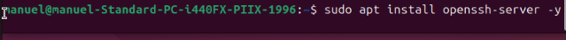
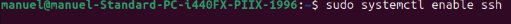
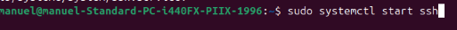

Con esto ya tendríamos la conexión por SSH lista para comenzar a trabajar.

> **Nota**: Durante las pruebas iniciales, se detectó que la red proporcionada por el comando `ip a` es una red privada, lo que debe tenerse en cuenta para la conectividad externa.

### Fase 1: Servidor Web y Entorno PHP
Comenzamos actualizando el repositorio y los paquetes del sistema:

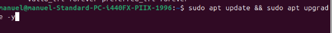

Continuamos instalando la pila **Apache2 + PHP + MySQL**:

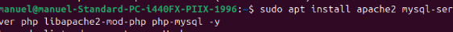

#### Verificación de Apache
Comprobamos que el servicio de Apache esté funcionando correctamente:

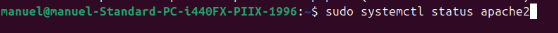

El estado debe mostrarse como `active (running)`.

#### Verificación de PHP
Realizamos una prueba para confirmar que el intérprete de PHP procesa los archivos correctamente:

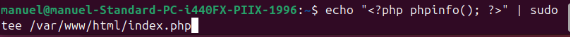

---

### Fase 2: Base de Datos y Gestión con phpMyAdmin
Procedemos a la instalación de **phpMyAdmin** para facilitar la administración de MySQL:

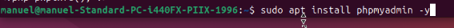

Durante la instalación, seleccionamos **apache2** y configuramos la contraseña necesaria:

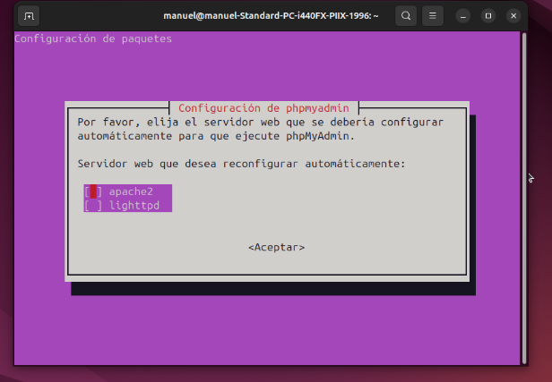

Finalmente, lo habilitamos en la configuración de Apache:

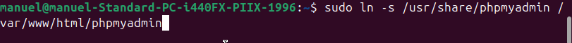

---

### Fase 3: Accesos y Seguridad (SSH + FTP)
Configuramos los accesos para la gestión de archivos y administración remota.

#### Activación de SSH
Aseguramos que el servicio SSH esté activo y escuchando:


#### Instalación y Configuración de FTP (vsftpd)
Instalamos el servidor FTP:


Editamos el archivo de configuración para permitir escritura, usuarios locales y enjaulamiento (chroot), además de habilitar SSL para mayor seguridad:


Configuración recomendada en `/etc/vsftpd.conf`:
```bash
write_enable=YES
local_enable=YES
chroot_local_user=YES
ssl_enable=YES
```

---

### Fase 4: Configuración de DNS con Bind9
Para gestionar nuestros dominios, instalamos **Bind9**:


#### Configuración de Zonas
Definimos una nueva zona en el servidor:

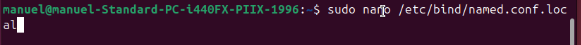

Añadimos la definición de la zona en el archivo correspondiente:
```bash
zone "midominio.local" {
    type master;
    file "/etc/bind/db.midominio.local";    
};
```

Creamos el archivo de zona para resolver las peticiones:

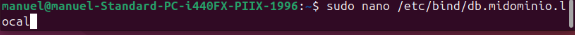

Contenido base para `db.midominio.local`:
```text
$TTL    604800
@       IN      SOA     midominio.local. root.midominio.local. (
                        2
                        604800
                        86400
                        2419200
                        604800 )

@       IN      NS      midominio.local.
@       IN      A       127.0.0.1
```

---

### Fase 5: Automatización del Despliegue
Esta es la parte central del proyecto, donde automatizamos la creación de nuevos clientes.

#### Script de Automatización
Creamos el script de despliegue:


El script realiza las siguientes tareas:
1. Creación de usuario del sistema.
2. Configuración de directorio web y permisos.
3. Generación automática de VirtualHost en Apache.
4. Creación de base de datos y usuario MySQL.
5. Registro automático del subdominio en el DNS.

```bash
#!/bin/bash

if [ $# -lt 2 ]; then
    echo "Uso: $0 usuario ip"
    exit 1
fi

USER=$1
IP=$2
DOMAIN="midominio.local"
SUBDOMAIN="$USER.$DOMAIN"
WEB_DIR="/var/www/html/$USER"
DB_NAME="${USER}_db"
DB_USER="$USER"
DB_PASS="1234"

echo "Creando cliente $USER..."

# Usuario sistema
sudo useradd -m -s /bin/bash $USER
echo "$USER:$DB_PASS" | sudo chpasswd

# Carpeta web
sudo mkdir -p $WEB_DIR
sudo chown -R $USER:$USER $WEB_DIR
echo "<h1>Web de $USER</h1>" | sudo tee $WEB_DIR/index.html

# VirtualHost
CONF="/etc/apache2/sites-available/$USER.conf"

sudo bash -c "cat > $CONF" <<EOL
<VirtualHost *:80>
    ServerName $SUBDOMAIN
    DocumentRoot $WEB_DIR

    <Directory $WEB_DIR>
        AllowOverride All
        Require all granted
    </Directory>
</VirtualHost>
EOL

sudo a2ensite $USER.conf
sudo systemctl reload apache2

# Base de datos
sudo mysql -e "CREATE DATABASE $DB_NAME;"
sudo mysql -e "CREATE USER '$DB_USER'@'localhost' IDENTIFIED BY '$DB_PASS';"
sudo mysql -e "GRANT ALL PRIVILEGES ON $DB_NAME.* TO '$DB_USER'@'localhost';"
sudo mysql -e "FLUSH PRIVILEGES;"

# DNS
echo "$USER IN A $IP" | sudo tee -a /etc/bind/db.midominio.local
sudo systemctl restart bind9

echo "Cliente creado correctamente"
```

Asignamos permisos de ejecución al script:


---

### Fase 6: Pruebas y Verificación
Realizamos la ejecución del script para comprobar que todo funciona según lo previsto:

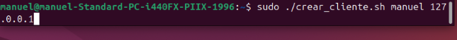

#### Resultados
Podemos verificar que el cliente se ha creado correctamente y el entorno está operativo:

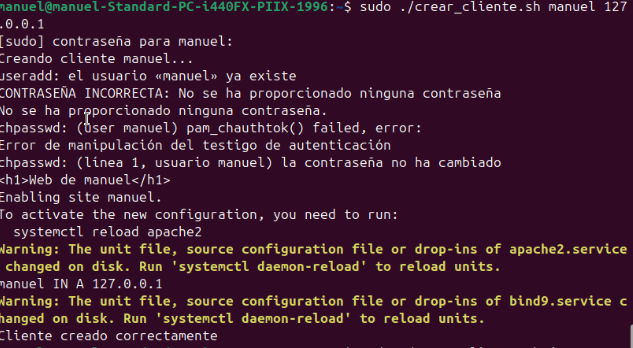


---

## 🛠️ Uso
Para crear un nuevo cliente, ejecuta el script de automatización pasando el nombre de usuario y la dirección IP:
```bash
sudo ./crear_cliente.sh nombre_usuario 192.168.1.XX
```


