0) Preparación inicial
Actualiza el sistema y herramientas básicas.

    sudo apt update && sudo apt -y upgrade
    sudo apt -y install curl wget unzip git

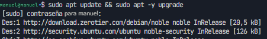
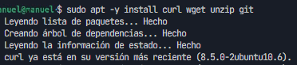

1) Configurar dominios locales (archivo /etc/hosts)
Edita /etc/hosts para resolver nombres internos al propio equipo.

    sudo nano /etc/hosts

Añade al final:
    127.0.0.1   centro.intranet
    127.0.0.1   departamentos.centro.intranet
    127.0.0.1   servidor2.centro.intranet

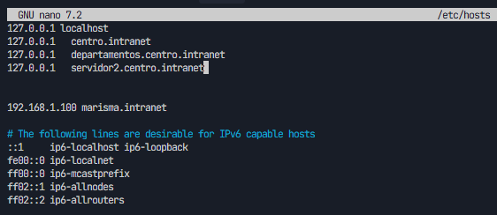

Guarda y cierra , CTRL + O , CTRL + X.

Comprobación rápida:

    ping -c 1 centro.intranet
    ping -c 1 departamentos.centro.intranet
    ping -c 1 servidor2.centro.intranet
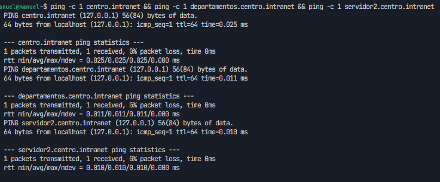   

2) Instalar Apache y crear estructura de sitios
Instala Apache y utilidades:

    sudo apt -y install apache2 apache2-utils

Crea las carpetas para los dos sitios de Apache:

    sudo mkdir -p /var/www/centro.intranet
    sudo mkdir -p /var/www/departamentos.centro.intranet

Asigna permisos al usuario de Apache (www-data):

    sudo chown -R www-data:www-data /var/www/centro.intranet /var/www/departamentos.centro.intranet
    sudo chmod -R 755 /var/www
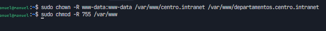
Verifica el estado del servicio:

    sudo systemctl status apache2 --no-pager
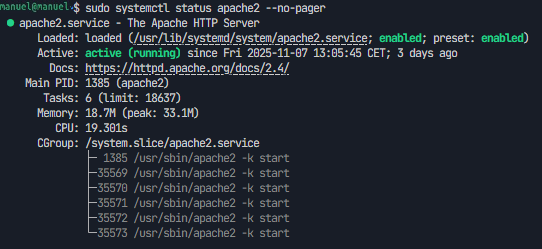

3) Activar soporte PHP y MySQL
Instala PHP para Apache y cliente/servidor de MySQL (MariaDB también es válido):

    sudo apt -y install libapache2-mod-php php php-mysql php-cli php-curl php-xml php-gd
    sudo apt -y install mysql-server

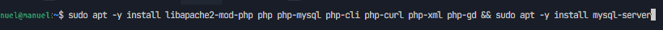

Seguridad básica de MySQL:

    sudo mysql_secure_installation

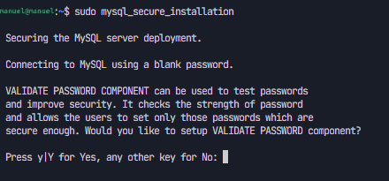

Reinicia Apache tras instalar módulos:

    sudo systemctl restart apache2

4) Configurar VirtualHosts de Apache
Crearemos dos sitios: centro.intranet (WordPress) y departamentos.centro.intranet (Python con mod_wsgi).

4.1) VirtualHost para centro.intranet

    sudo nano /etc/apache2/sites-available/centro.intranet.conf

Contenido:

    <VirtualHost *:80>
        ServerName centro.intranet
        DocumentRoot /var/www/centro.intranet

        <Directory /var/www/centro.intranet>
            AllowOverride All
            Options Indexes FollowSymLinks
            Require all granted
        </Directory>

        ErrorLog ${APACHE_LOG_DIR}/centro_error.log
        CustomLog ${APACHE_LOG_DIR}/centro_access.log combined
    </VirtualHost>

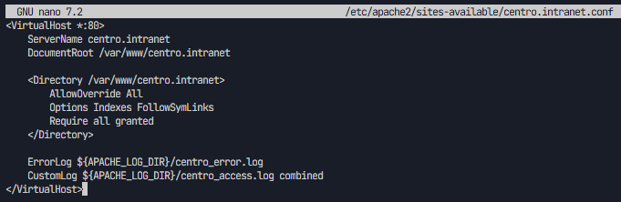
4.2) VirtualHost para departamentos.centro.intranet

    sudo nano /etc/apache2/sites-available/departamentos.centro.intranet.conf

Contenido:

    <VirtualHost *:80>
        ServerName departamentos.centro.intranet
        DocumentRoot /var/www/departamentos.centro.intranet

        # Configuración WSGI (se completará en el paso 6)
        WSGIDaemonProcess departamentos user=www-data group=www-data threads=5
        WSGIProcessGroup departamentos
        WSGIScriptAlias / /var/www/departamentos.centro.intranet/wsgi.py

        <Directory /var/www/departamentos.centro.intranet>
        Require all granted
        </Directory>

        ErrorLog ${APACHE_LOG_DIR}/departamentos_error.log
        CustomLog ${APACHE_LOG_DIR}/departamentos_access.log combined
    </VirtualHost>

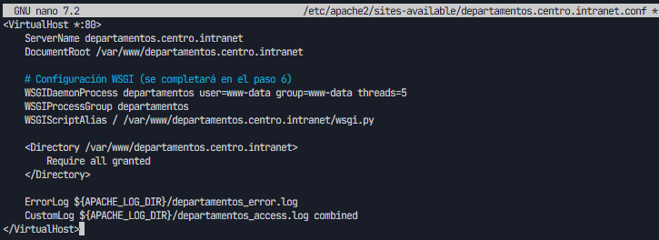

Habilita sitios y módulos necesarios:

    sudo a2ensite centro.intranet.conf departamentos.centro.intranet.conf
    sudo a2enmod rewrite
    sudo systemctl reload apache2

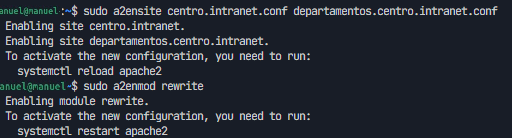

5) Instalar y configurar WordPress en centro.intranet
5.1) Crear base de datos y usuario en MySQL
Accede a MySQL:

    sudo mysql

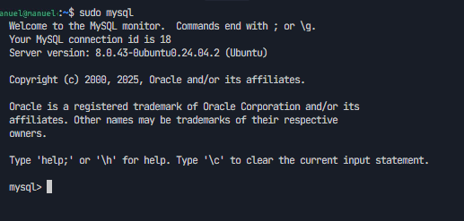
Ejecuta:

    CREATE DATABASE wordpress CHARACTER SET utf8mb4 COLLATE utf8mb4_unicode_ci;
    CREATE USER 'wpuser'@'localhost' IDENTIFIED BY 'wp_password_seguro';
    GRANT ALL PRIVILEGES ON wordpress.* TO 'wpuser'@'localhost';
    FLUSH PRIVILEGES;
    EXIT;

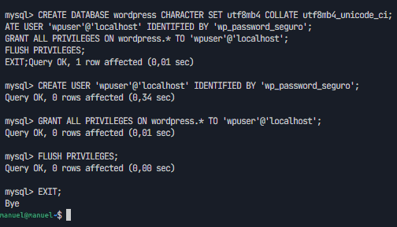
5.2) Descargar WordPress y preparar DocumentRoot

    cd /tmp
    wget https://wordpress.org/latest.zip
    unzip latest.zip
    sudo rsync -avP wordpress/ /var/www/centro.intranet/

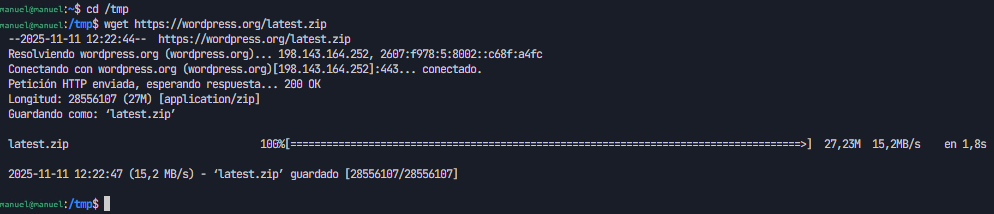
Ahora hacemos el unzip y el rsync para copiar los archivos a la carpeta de wordpress

5.3) Configurar wp-config.php

    cd /var/www/centro.intranet
    sudo cp wp-config-sample.php wp-config.php
    sudo nano wp-config.php

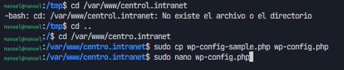
Actualiza:

    define( 'DB_NAME', 'wordpress' );
    define( 'DB_USER', 'wpuser' );
    define( 'DB_PASSWORD', 'wp_password_seguro' );
    define( 'DB_HOST', 'localhost' );

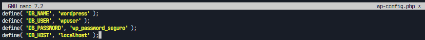
Genera claves y sales (es una api gratuita): https://api.wordpress.org/secret-key/1.1/salt/

Permisos:

    sudo chown -R www-data:www-data /var/www/centro.intranet
    sudo find /var/www/centro.intranet -type d -exec chmod 755 {} \;
    sudo find /var/www/centro.intranet -type f -exec chmod 644 {} \;

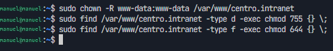
Ahora abrimos en nuestro navegador el localhost o centro intranet y nos debe de salir la pagina de instalacion de wordpress

    http://centro.intranet

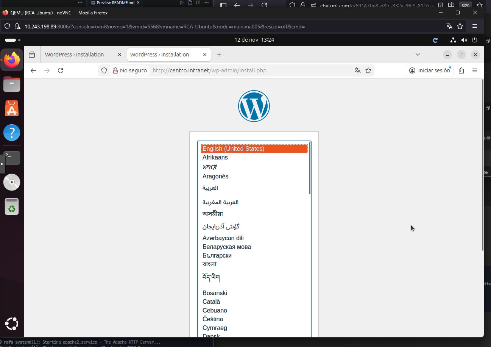
Ahora vamos a ir completando la instalacion paso a paso el instalador web (título del sitio, usuario admin, etc.).

6) Activar mod_wsgi y desplegar aplicación Python en departamentos.centro.intranet
Instala mod_wsgi para Python 3:

    sudo apt -y install libapache2-mod-wsgi-py3 python3-venv
    sudo a2enmod wsgi
    sudo systemctl restart apache2

6.1) Crear aplicación mínima
Estructura básica:

    sudo bash -c 'cat > /var/www/departamentos.centro.intranet/app.py' << 'EOF'
    def application(environ, start_response):
        status = '200 OK'
        headers = [('Content-Type', 'text/html; charset=utf-8')]
        start_response(status, headers)
        body = [b"<h1>Aplicación Python OK</h1>",
            b"
Ruta: %s
" % environ.get('PATH_INFO', '/').encode('utf-8')]
        return body
    EOF

    sudo bash -c 'cat > /var/www/departamentos.centro.intranet/wsgi.py' << 'EOF'
    import sys
    sys.path.insert(0, '/var/www/departamentos.centro.intranet')
    from app import application
    EOF

    sudo chown -R www-data:www-data /var/www/departamentos.centro.intranet

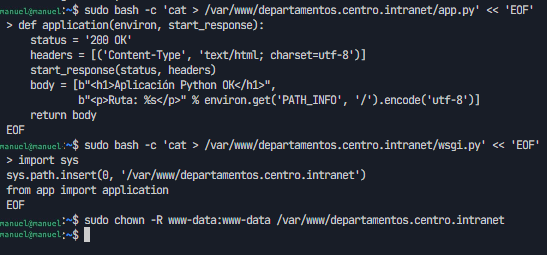
Reinicia Apache y prueba:

    http://departamentos.centro.intranet/

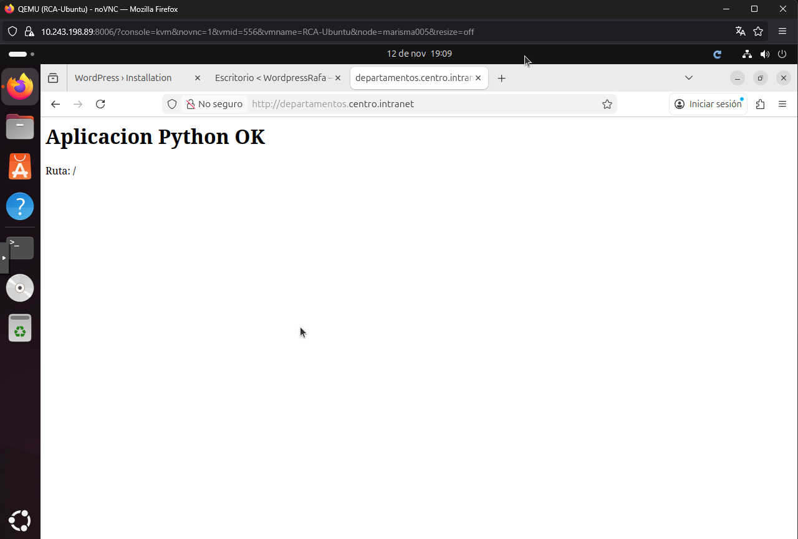
6.2) Proteger acceso con autenticación HTTP básica
Instala utilidades y crea usuarios:

    sudo apt -y install apache2-utils
    sudo htpasswd -c /etc/apache2/.htpasswd profesor
    # (para más usuarios: sudo htpasswd /etc/apache2/.htpasswd alumno)

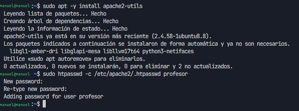
Restringe el Directorio en el VirtualHost (edita el archivo creado en el paso 4.2):

    sudo nano /etc/apache2/sites-available/departamentos.centro.intranet.conf

Ajusta el bloque Directory:

    <Directory /var/www/departamentos.centro.intranet>
        AuthType Basic
        AuthName "Acceso restringido"
        AuthUserFile /etc/apache2/.htpasswd
        Require valid-user
    </Directory>

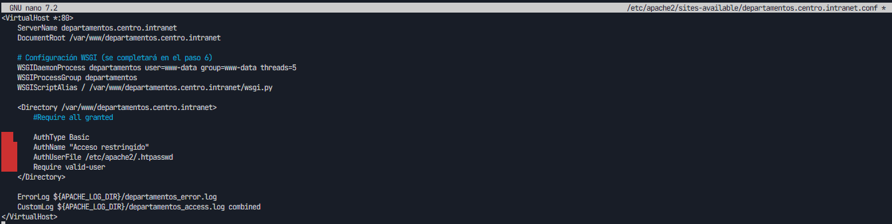
Aplica cambios:

    sudo systemctl reload apache2

Prueba en navegador y valida el prompt de autenticación. 

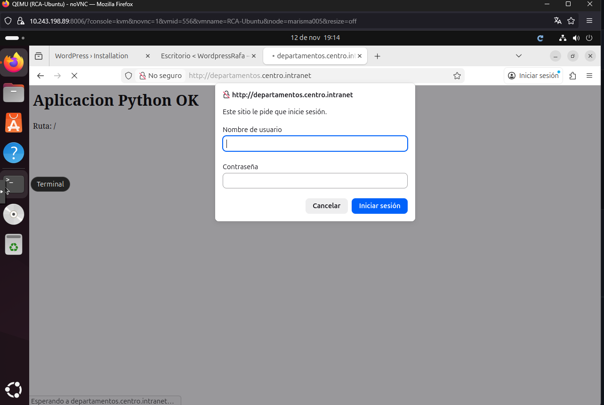
7) Instalar y configurar AWStats
Instala y habilita configuración de AWStats en Apache:

    sudo apt -y install awstats
    sudo a2enmod cgi
    sudo a2enconf awstats
    sudo systemctl reload apache2

Crea conf específica del sitio:

    sudo cp /etc/awstats/awstats.conf /etc/awstats/awstats.centro.intranet.conf
    sudo nano /etc/awstats/awstats.centro.intranet.conf

Valores clave:

    LogFile="/var/log/apache2/centro_access.log"
    SiteDomain="centro.intranet"
    HostAliases="localhost 127.0.0.1 www.centro.intranet"
    LogFormat=1

Actualiza estadísticas iniciales:

    sudo /usr/lib/cgi-bin/awstats.pl -config=centro.intranet -update

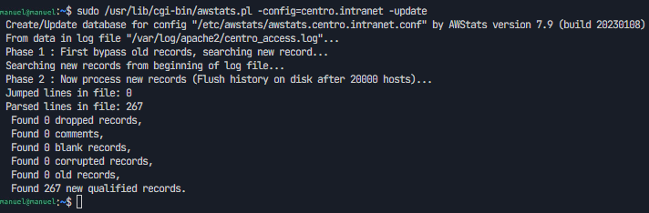
Accede al informe:

    http://centro.intranet/awstats/awstats.pl?config=centro.intranet

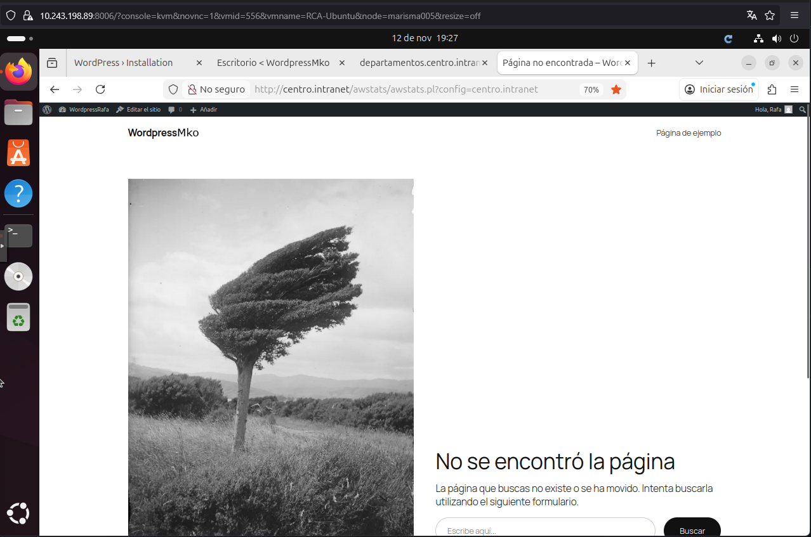

8) Segundo servidor: Nginx en puerto 8080 con PHP y phpMyAdmin
Instala Nginx + PHP-FPM:

    sudo apt -y install nginx php-fpm php-mysql

Crea DocumentRoot:

    sudo mkdir -p /var/www/servidor2.centro.intranet
    echo "<?php phpinfo();" | sudo tee /var/www/servidor2.centro.intranet/info.php
    sudo chown -R www-data:www-data /var/www/servidor2.centro.intranet

Configura el server block de Nginx (puerto 8080):

    sudo nano /etc/nginx/sites-available/servidor2.centro.intranet

Contenido (ajusta la versión del socket de PHP según tu sistema, p. ej. php8.2-fpm):

    erver {
        listen 8080;
        server_name servidor2.centro.intranet;
        root /var/www/servidor2.centro.intranet;
        index index.php index.html index.htm;

        location / {
            try_files $uri $uri/ /index.php?$args;
        }

        location ~ \.php$ {
            include snippets/fastcgi-php.conf;
            fastcgi_pass unix:/run/php/php8.2-fpm.sock;
        }

        location ~* \.(js|css|png|jpg|jpeg|gif|ico)$ {
            expires 1d;
            access_log off;
        }
    }

    Habilita sitio y recarga Nginx:

    
    sudo ln -s /etc/nginx/sites-available/servidor2.centro.intranet /etc/nginx/sites-enabled/
    sudo nginx -t
    sudo systemctl reload nginx

Prueba PHP info:

    http://servidor2.centro.intranet:8080/info.php

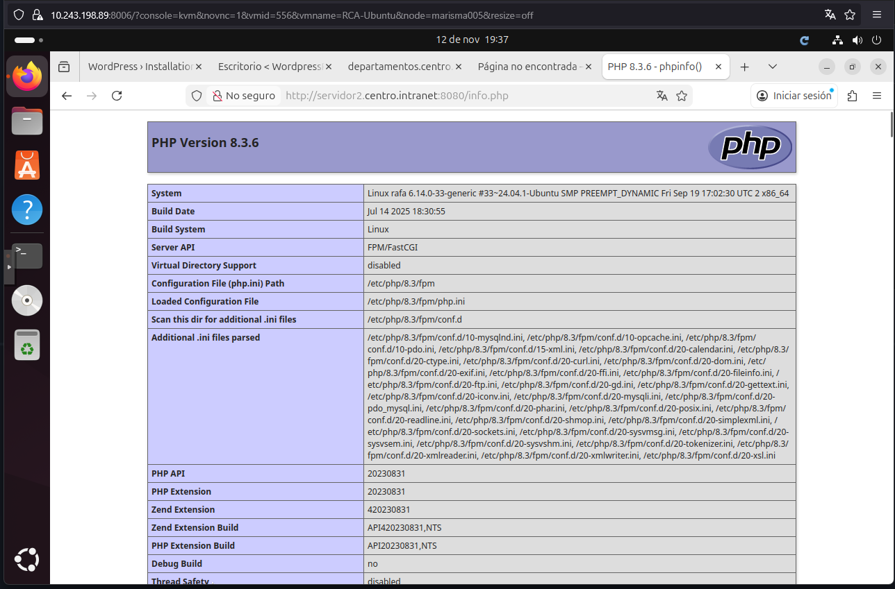

8.1) Instalar phpMyAdmin con Nginx
Instala phpMyAdmin:

    sudo apt -y install phpmyadmin

Debemos seleccionar apache2 y aceptar luego nos pondrá para elegir una contraseña , en mi caso no le puse

Haz accesible phpMyAdmin bajo Nginx (método sencillo con symlink):

    sudo ln -s /usr/share/phpmyadmin /var/www/servidor2.centro.intranet/phpmyadmin
    sudo systemctl reload nginx

Accede:

    http://servidor2.centro.intranet:8080/phpmyadmin

.png)
