🚀 Instalación del entorno LAMP (Linux, Apache, MySQL, PHP)

Este documento describe los pasos básicos para instalar y comprobar el correcto funcionamiento de Apache, MySQL y PHP en un sistema basado en Linux.

📋 Resumen de pasos
🔧 Servicio	🖥️ Comando de instalación	✅ Comprobación
Apache	sudo apt install apache2	Abrir http://localhost
MySQL	sudo apt install mysql-server	sudo mysql
PHP	sudo apt install php libapache2-mod-php php-mysql	php -v
Reinicio Apache	sudo systemctl restart apache2	sudo systemctl status apache2
📌 Instalación de Apache

Instalamos Apache con:

sudo apt install apache2
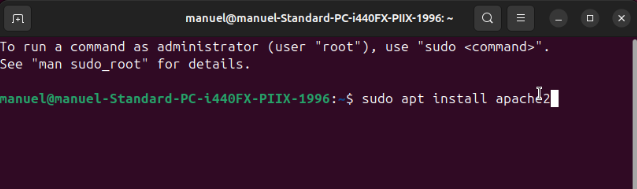

Para comprobar que funciona, abrimos el navegador y escribimos:

http://localhost

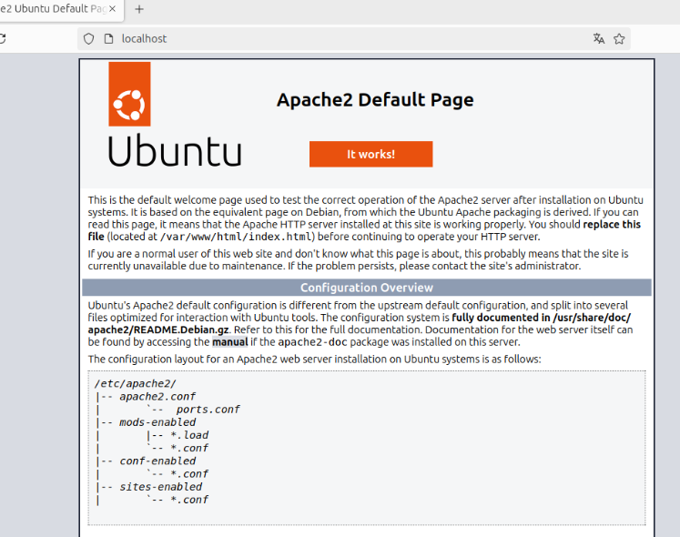

➡️ Si aparece la página de bienvenida de Apache, la instalación se realizó correctamente.

📌 Instalación de MySQL

Instalamos MySQL con:

sudo apt install mysql-server
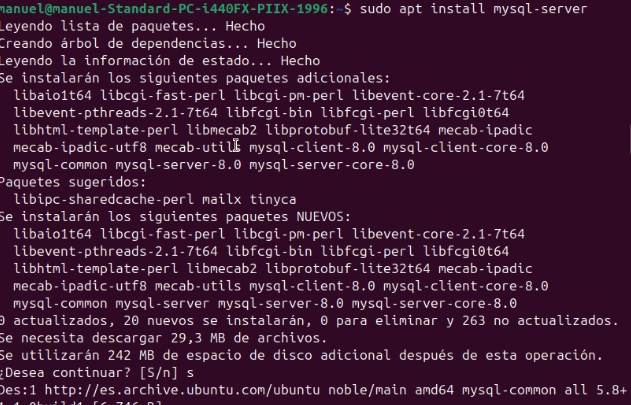

Entramos a la consola de MySQL para verificar:

sudo mysql
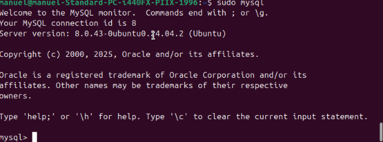

Si accede sin errores 👉 está correctamente instalado.
Para salir:

exit;

📌 Instalación de PHP

Instalamos PHP con los módulos necesarios para Apache y MySQL:

sudo apt install php libapache2-mod-php php-mysql
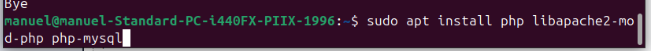

Verificamos la versión instalada con:

php -v
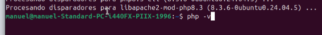
📌 Reinicio de Apache

Finalmente reiniciamos Apache para aplicar los cambios:

sudo systemctl restart apache2 && sudo systemctl status apache2

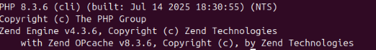
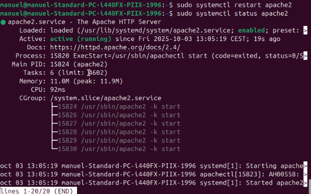

✅ Con esto ya tienes instalado un entorno LAMP completo y listo para comenzar a trabajar con proyectos web en Linux.

Crear un host virtual para mi sitio web

con el comando: 
sudo mkdir /var/www/your_domain
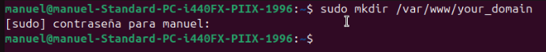

A continuación, asigne la propiedad del directorio con la variable de entorno $USER

sudo chown -R $USER:$USER /var/www/your_domain

Luego, abra un nuevo archivo de configuración en el directorio sites-available

sudo nano /etc/apache2/sites-available/your_domain.conf
De esta manera, se creará un nuevo archivo en blanco.
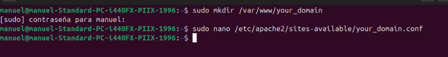
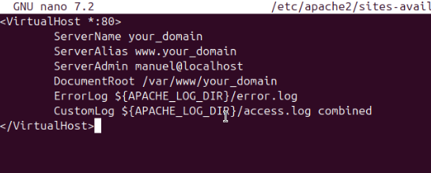

Ahora, puede usar a2ensite para habilitar el nuevo host virtual:

sudo a2ensite your_domain.conf
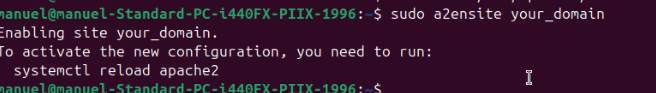

Puede ser conveniente deshabilitar el sitio web predeterminado que viene instalado con Apache.
Para deshabilitarlo, use el siguiente comando:

sudo a2dissite 000-default.conf
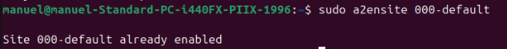

Para asegurarse de que su archivo de configuración no contenga errores de sintaxis, ejecute lo siguiente:

sudo apache2ctl configtest
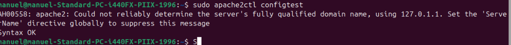

Por último, vuelva a cargar Apache para que estos cambios surtan efecto:

sudo systemctl reload apache2

Ahora, su nuevo sitio web está activo, pero el directorio root web /var/www/your_domain todavía está vacío. Cree un archivo index.html en esa ubicación para poder probar que el host virtual funcione según lo previsto:

sudo nano /var/www/your_domain/index.html
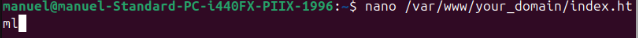
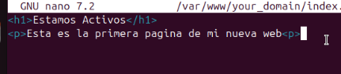

Ahora, diríjase a su navegador y acceda al nombre de dominio o la dirección IP de su servidor una vez más:

http://your_domain
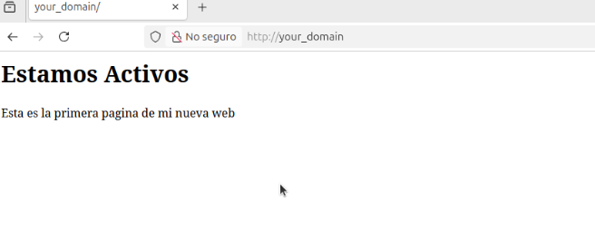

